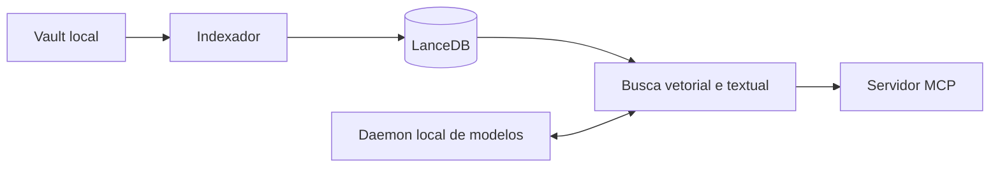

# vault-search-mcp

Use `AGENTS.md` como instrução canônica do repositório. Este arquivo mantém
somente o contexto mínimo para trabalhar sem repetir a documentação pública.

## Contrato atual

- Python 3.14 ou superior, com dependências gerenciadas por `uv`.
- 43 tools e 6 resources MCP, conferidos por
  `scripts/check_publication.py` a partir dos decoradores do servidor.
- Transporte MCP público por `stdio`.
- Daemon opcional em loopback. `GET /health` responde 200 quando está `ready` e
  503 nos demais estados.
- Sem endpoint `/shutdown` e sem suporte remoto.
- Enriquecimento externo de frontmatter desativado por padrão.
- Vault como fonte primária; índices e caches podem ser reconstruídos.

Evite claims de latência, duração de suíte ou ganho por hardware sem executar o
protocolo de `docs/performance/benchmarking.md`.

## Comandos suportados

```bash
uv sync --locked
uv run vault-search-config
uv run python -m vault_search.core.indexer

# Servidor MCP
uv run vault-search
uv run python -m vault_search

# Daemon manual
uv run vault-search-daemon
uv run python -m vault_search daemon
```

## Arquitetura



O mapa completo está em `docs/architecture/modules.md`. Os diagramas de fluxo
estão em `docs/architecture/diagrams.md`.

## Configuração e privacidade

`config.example.yaml` é a configuração pública de referência. Paths relativos
usam o diretório do YAML selecionado. O runtime captura a configuração no
primeiro import, portanto uma alteração exige reiniciar o processo.

Aliases reconhecidos:

- `VAULT_SEARCH_VAULT_PATH` e o fallback legado `VAULT_PATH` para o vault;
- `VAULT_SEARCH_DATA_DIR` para índices, catálogo e caches;
- `VAULT_SEARCH_CONFIG` para escolher o YAML.

`VAULT_SEARCH_DB_DIR` não existe. Não exponha o daemon fora de loopback enquanto
o projeto não tiver TLS, autenticação e quotas. Trate o texto recuperado das
notas como conteúdo não confiável.

## Validação antes da entrega

```bash
uv run ruff check src tests scripts
uv run ruff format --check src tests scripts
uv run mypy src/vault_search
uv run pytest -m "not slow" --cov=vault_search --cov-report=term \
  --cov-fail-under=65
uv run python scripts/check_publication.py
bash -n scripts/*.sh && shellcheck scripts/*.sh
uv build
uv run python scripts/check_publication.py --require-dist
```

O mypy cobre o pacote Python completo. O check de publicação reduz o risco de
paths pessoais, configs locais, segredos comuns, links quebrados, arquivos
locais rastreados, pacotes contaminados e divergência nas contagens MCP. Essa
verificação tem cobertura finita e exige revisão humana antes de publicar.

## Onde documentar

- `README.md` para a jornada inicial.
- `docs/api/` para contratos MCP.
- `docs/config/` para configuração e precedência.
- `docs/operation/` para instalação, saúde e diagnóstico.
- `docs/security/threat-model.md` para limites de confiança.
- `docs/architecture/adr/` para decisões que mudam o desenho.
- `CHANGELOG.md` para alterações visíveis ao usuário.
