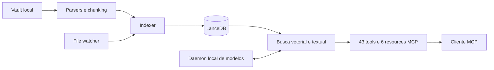

<p align="center">
  
</p>

<p align="center">
  <a href="https://github.com/everton-dgn/vault-search-mcp/actions/workflows/ci.yml"></a>
  
  <a href="https://github.com/everton-dgn/vault-search-mcp/blob/main/LICENSE"></a>
  
</p>

<p align="center">
  <a href="#início-rápido">Início rápido</a> ·
  <a href="https://github.com/everton-dgn/vault-search-mcp/blob/main/docs/README.md">Documentação</a> ·
  <a href="https://github.com/everton-dgn/vault-search-mcp/blob/main/docs/api/tools.md">43 tools</a> ·
  <a href="https://github.com/everton-dgn/vault-search-mcp/blob/main/docs/security/threat-model.md">Segurança</a> ·
  <a href="https://github.com/everton-dgn/vault-search-mcp/blob/main/CONTRIBUTING.md">Contribuir</a>
</p>

# vault-search-mcp

Busca híbrida local para vaults Obsidian e outras bases Markdown. O servidor
combina recuperação vetorial, busca textual, reranking e relações de grafo,
entrega tudo por MCP e mantém o vault sob controle de quem opera a máquina.

> Estado do projeto: alpha. A superfície MCP possui testes de contrato, mas pode
> mudar antes da versão 1.0.

## O que torna o projeto diferente

| Capacidade | Como funciona | Consequência prática |
|---|---|---|
| Recuperação híbrida | Vetores, FTS e reranking compartilham o mesmo índice | Relações semânticas não apagam nomes, siglas e termos raros |
| Conhecimento conectado | Backlinks, tags, pastas e grafo fazem parte da API MCP | O cliente pode pesquisar e também navegar pela estrutura do vault |
| Controle local | Transporte MCP por `stdio`; daemon opcional somente em loopback | Notas e índices permanecem na máquina no modo padrão |
| Fonte reconstruível | O vault é primário; LanceDB, catálogo e caches são derivados | Uma falha no índice não transforma o banco vetorial na única cópia |
| Contratos verificáveis | CI confere tipos, testes, pacote, links e o registro MCP | Documentação e código falham juntos quando divergem |

## Por que este projeto existe

Pesquisar por palavra exata perde relações semânticas. Usar apenas embeddings
pode perder nomes, siglas e termos raros. O vault-search-mcp executa os dois
caminhos e permite que um cliente MCP escolha a ferramenta adequada para cada
pergunta.

O projeto também trata o vault como uma base viva:

- indexa Markdown, MDX, texto, PDF e Obsidian Canvas;
- acompanha alterações no sistema de arquivos;
- navega por links, tags, pastas e relações de grafo;
- cria e atualiza notas com validação de frontmatter;
- atribui UUID v7 às notas Markdown na criação e na reindexação incremental;
- mantém modelos em um daemon local opcional para evitar recargas repetidas.

## Contrato de confiança

O modo padrão foi desenhado para uso local e individual.

- O vault e os índices permanecem no computador do operador.
- O daemon escuta apenas em `127.0.0.1` por padrão.
- O enriquecimento externo de frontmatter começa desativado.
- Conteúdo recuperado pode conter instruções maliciosas. O cliente MCP deve
  tratá-lo como dado não confiável, nunca como instrução de sistema.
- O servidor não oferece autenticação, isolamento multiusuário ou quotas para
  exposição pública.

Leia [SECURITY.md][security-policy] e o [modelo de ameaças][threat-model] antes
de usar fontes compartilhadas ou não confiáveis.

## Arquitetura em 30 segundos



O índice vetorial e o catálogo auxiliar são reconstruíveis a partir do vault.
As notas são a fonte primária. Veja a
[visão arquitetural][architecture-overview] e os
[registros de decisão][architecture-decisions].

## Requisitos

| Componente | Estado |
|---|---|
| Python 3.14 ou superior | Obrigatório |
| [uv](https://docs.astral.sh/uv/) | Gerenciador suportado |
| macOS ou Linux | Plataformas cobertas pelos scripts do daemon |
| Tesseract | Opcional, usado somente para OCR de PDFs escaneados |
| CPU | Backend reproduzível usado pelo lockfile |
| CUDA ou MPS | Detectado quando a distribuição instalada do PyTorch oferece o backend |

O suporte a Windows ainda não possui instalador de daemon nem validação em CI.

## Início rápido

### 1. Prepare o ambiente

Clone o repositório e prepare o ambiente bloqueado pelo lockfile:

```bash
git clone https://github.com/everton-dgn/vault-search-mcp.git
cd vault-search-mcp
uv sync --locked
cp config.example.yaml config.yaml
uv run vault-search-config
```

O lockfile seleciona a distribuição CPU do PyTorch para evitar downloads de
CUDA em máquinas sem GPU. Para CUDA, escolha o índice compatível seguindo o
[guia oficial do uv para PyTorch][uv-pytorch] e gere novamente o lockfile. No
macOS, a distribuição padrão preserva o backend MPS.

Edite apenas `paths.vault_path` em `config.yaml` para apontar para seu vault.
O arquivo local fica ignorado pelo Git.

```yaml
paths:
  vault_path: "vaults/obsidian_vault"
  data_dir: "data"
```

Você também pode manter o vault fora do repositório e definir o caminho por
ambiente:

```bash
export VAULT_SEARCH_VAULT_PATH="$PWD/vaults/obsidian_vault"
```

### 2. Crie o índice

```bash
uv run python -m vault_search.core.indexer
```

A primeira execução pode baixar modelos. O volume transferido e o tempo variam
conforme as versões resolvidas, o cache local e a plataforma.

### 3. Inicie o servidor MCP

```bash
uv run vault-search
# Fronteira equivalente sem usar o script instalado:
uv run python -m vault_search
```

O transporte padrão é `stdio`. Configure seu cliente MCP para executar esse
comando com a raiz do repositório como diretório de trabalho. Um exemplo para
clientes que aceitam configuração JSON:

```json
{
  "mcpServers": {
    "vault-search": {
      "command": "uv",
      "args": ["run", "vault-search"]
    }
  }
}
```

O cliente precisa iniciar o processo dentro do repositório, ou passar sua opção
equivalente de diretório de trabalho. Consulte o
[guia de instalação][installation] para daemon, OCR e
verificação do ambiente.

## Ferramentas MCP

O registro atual contém 43 tools e 6 resources. A CI confere essa contagem
diretamente nos decoradores do servidor para impedir divergência documental.

| Grupo | Quantidade | Exemplos |
|---|---:|---|
| Busca | 7 | `search_vault`, `search_vault_hybrid`, `search_advanced` |
| Navegação | 10 | `get_backlinks`, `find_broken_links`, `daily_note` |
| Indexação | 6 | `reindex_vault`, `sync_vault`, `vector_index_status` |
| CRUD e frontmatter | 13 | `read_note`, `create_note`, `validate_frontmatter` |
| Grafo | 4 | `graph_data`, `suggest_links`, `find_bridge_notes` |
| Sistema | 3 | `health_check`, `system_stats`, `benchmark_search` |

### Recursos navegáveis

| URI | Retorno |
|---|---|
| `vault://stats` | Estado resumido do índice |
| `vault://folders` | Árvore de pastas |
| `vault://notes` | Snapshot de 5.000 notas com `total`, `returned` e `has_more` |
| `vault://notes/{path*}` | Conteúdo de uma nota por path relativo |
| `vault://search/recent` | Notas recentes |
| `vault://tags` | Distribuição de tags |

O [catálogo completo][tools-catalog] separa as tools por domínio e aponta
para os contratos detalhados.

`vault://notes` não recebe cursor nem `offset`. Para percorrer um catálogo maior
que 5.000 entradas, use `list_notes` e avance pela paginação da tool.

## Exemplos de uso

Depois que o cliente registrar o servidor, pedidos naturais podem acionar as
tools:

```text
Encontre notas relacionadas a consistência eventual e traga as cinco mais úteis.
Procure por "RFC 9562" na pasta de arquitetura usando busca híbrida.
Liste notas órfãs e sugira possíveis conexões sem editar o vault.
Mostre arquivos modificados nos últimos sete dias.
```

Operações de escrita devem ser confirmadas pelo usuário no cliente. `delete_note`
move a nota para a pasta `.trash` do vault.

## Modos de execução dos modelos

| Modo | Quando usar | Custo operacional |
|---|---|---|
| Processo MCP | Desenvolvimento e uso esporádico | Pode recarregar modelos entre sessões |
| Daemon local | Uso frequente ou vários clientes | Mantém modelos residentes em memória |
| Daemon obrigatório | Operação controlada sem fallback | Falha quando o daemon não responde |

Instale o daemon somente após validar a configuração local:

```bash
# macOS
./scripts/install-daemon.sh

# Linux com systemd de usuário
./scripts/install-daemon-linux.sh

curl --fail http://127.0.0.1:9847/health
```

Para uma execução manual sem instalar serviço, use `uv run vault-search-daemon`
ou `uv run python -m vault_search daemon`.

Os detalhes de ciclo de vida e remoção recuperável estão em
[docs/daemon-setup.md][daemon-guide].

## Desempenho com evidência

Este README não publica números de latência sem contexto. Hardware, volume do
vault, quantidade de chunks, estado do cache, device e versões dos modelos
alteram o resultado.

Use a tool `benchmark_search` ou o protocolo descrito em
[docs/performance/benchmarking.md][benchmarking]. Um relatório
publicável precisa registrar:

- versão e commit do projeto;
- sistema operacional, CPU, RAM e device;
- tamanho do vault, notas e chunks;
- estado frio ou aquecido dos modelos e índices;
- número de amostras, mediana e p95;
- comando ou tool usados para reproduzir a medição.

## Configuração

`config.example.yaml` é a referência canônica. A precedência é:

1. `VAULT_SEARCH_CONFIG`, quando aponta para um arquivo existente;
2. `config.yaml` no diretório de trabalho;
3. `config.yml` no diretório de trabalho;
4. `config.yaml` ou `config.yml` na raiz da instalação, se diferente;
5. valores Pydantic do pacote.

Paths relativos são resolvidos a partir do diretório do YAML selecionado. Sem
arquivo, os defaults usam o diretório de trabalho.

O schema rejeita campos desconhecidos e combinações contraditórias antes do
startup. O default de FTS é neutro para vaults multilíngues; stemming específico
de idioma é opt-in. Pastas de metadados como `.git`, `.obsidian` e `.trash`
começam ignoradas.

Overrides de ambiente operacionais estão documentados em
[docs/config/variables.md][config-variables]. O servidor precisa ser
reiniciado após uma alteração de configuração.

## Desenvolvimento

O gate de shell exige ShellCheck quando os scripts do daemon forem alterados.

```bash
uv sync --locked
uv run ruff check src tests scripts
uv run ruff format --check src tests scripts
bash -n scripts/*.sh && shellcheck scripts/*.sh
uv run mypy src/vault_search
uv run pytest -m "not slow" --cov=vault_search --cov-report=term \
  --cov-fail-under=65
uv run python scripts/check_publication.py
uv build
uv run python scripts/check_publication.py --require-dist
```

Ruff cobre fonte, testes e scripts. O mypy verifica o pacote completo; a
cobertura começa em 65%, abaixo da medição limpa de 66%. O
[guia de qualidade][testing-guide] registra o contrato
e os limites de cada gate.

O último comando abre wheel e sdist sem extraí-los e rejeita configuração local,
dados de vault, paths inseguros e arquivos sensíveis dentro dos pacotes.

## Mapa da documentação

| Preciso de | Documento |
|---|---|
| Instalar e verificar | [Instalação][installation] |
| Configurar | [Configuração YAML][config-yaml] |
| Integrar uma tool | [Referência MCP][tools-catalog] |
| Entender o sistema | [Arquitetura][architecture-overview] |
| Operar o daemon | [Daemon][daemon-guide] |
| Diagnosticar falhas | [Troubleshooting][troubleshooting] |
| Medir desempenho | [Benchmarking][benchmarking] |
| Avaliar segurança | [Modelo de ameaças][threat-model] |
| Contribuir | [CONTRIBUTING.md][contributing] |

O índice completo está em [docs/README.md][docs-home].

## Limitações conhecidas

- O protocolo HTTP do daemon é interno e não deve ser exposto na rede.
- Acesso remoto ao daemon não é suportado; faltam TLS, autenticação, quotas e
  uma análise própria dessa fronteira.
- O servidor não neutraliza instruções encontradas dentro das notas.
- Modelos e dependências de ML ocupam espaço relevante e podem exigir memória
  acima da disponível em ambientes pequenos.
- A versão 0.1 ainda não garante estabilidade de schema, retorno ou nomes de
  tools entre releases.
- A documentação de compatibilidade cobre macOS e Linux. Outros sistemas ainda
  precisam de evidência automatizada.

## Participação e segurança

Leia [CONTRIBUTING.md][contributing] antes de enviar mudanças. Dúvidas de uso
seguem [SUPPORT.md][support] e o
[GitHub Discussions](https://github.com/everton-dgn/vault-search-mcp/discussions).
Vulnerabilidades devem seguir o canal privado descrito em
[SECURITY.md][security-policy], sem anexar conteúdo real do vault, segredos ou
caminhos da máquina.

## Licença

Distribuído sob a licença [MIT][license].

[architecture-decisions]: https://github.com/everton-dgn/vault-search-mcp/blob/main/docs/architecture/decisions.md
[architecture-overview]: https://github.com/everton-dgn/vault-search-mcp/blob/main/docs/architecture/overview.md
[benchmarking]: https://github.com/everton-dgn/vault-search-mcp/blob/main/docs/performance/benchmarking.md
[config-variables]: https://github.com/everton-dgn/vault-search-mcp/blob/main/docs/config/variables.md
[config-yaml]: https://github.com/everton-dgn/vault-search-mcp/blob/main/docs/config/yaml.md
[contributing]: https://github.com/everton-dgn/vault-search-mcp/blob/main/CONTRIBUTING.md
[daemon-guide]: https://github.com/everton-dgn/vault-search-mcp/blob/main/docs/daemon-setup.md
[docs-home]: https://github.com/everton-dgn/vault-search-mcp/blob/main/docs/README.md
[installation]: https://github.com/everton-dgn/vault-search-mcp/blob/main/docs/operation/installation.md
[license]: https://github.com/everton-dgn/vault-search-mcp/blob/main/LICENSE
[security-policy]: https://github.com/everton-dgn/vault-search-mcp/blob/main/SECURITY.md
[support]: https://github.com/everton-dgn/vault-search-mcp/blob/main/SUPPORT.md
[testing-guide]: https://github.com/everton-dgn/vault-search-mcp/blob/main/docs/development/testing.md
[threat-model]: https://github.com/everton-dgn/vault-search-mcp/blob/main/docs/security/threat-model.md
[tools-catalog]: https://github.com/everton-dgn/vault-search-mcp/blob/main/docs/api/tools.md
[troubleshooting]: https://github.com/everton-dgn/vault-search-mcp/blob/main/docs/operation/troubleshooting.md
[uv-pytorch]: https://docs.astral.sh/uv/guides/integration/pytorch/
