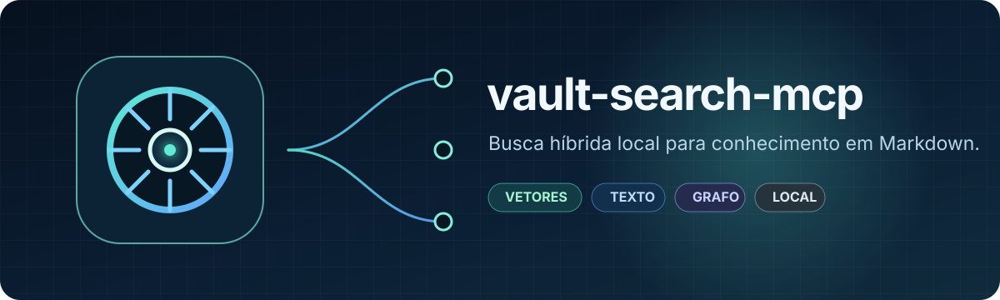
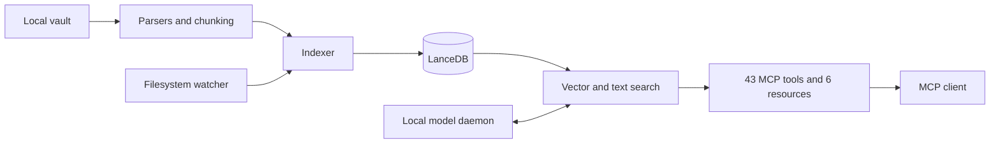

<p align="center">
  
</p>

<p align="center">
  <a href="https://github.com/everton-dgn/vault-search-mcp/actions/workflows/ci.yml"></a>
  
  <a href="LICENSE"></a>
  
</p>

<p align="center">
  <a href="#quick-start">Quick start</a> ·
  <a href="docs/README.md">Documentation</a> ·
  <a href="docs/api/tools.md">43 tools</a> ·
  <a href="docs/security/threat-model.md">Security</a> ·
  <a href="CONTRIBUTING.md">Contributing</a>
</p>

# vault-search-mcp

Local hybrid search for Obsidian vaults and other Markdown knowledge bases.
The server combines vector retrieval, full-text search, reranking, and graph
relationships behind a single MCP interface while keeping the vault under the
operator's control.

> Project status: alpha. The MCP surface has contract tests, but it may change
> before version 1.0.

## What makes it different

| Capability | How it works | Practical result |
|---|---|---|
| Hybrid retrieval | Vectors, FTS, and reranking share one derived index | Semantic matches do not erase names, acronyms, or rare exact terms |
| Connected knowledge | Backlinks, tags, folders, and graph relationships are first-class MCP operations | Clients can search the vault and navigate its structure |
| Local boundary | MCP uses `stdio`; the optional HTTP daemon accepts loopback hosts only | Notes and indexes stay on the machine in the default setup |
| Rebuildable state | The vault is primary; LanceDB, the catalog, and caches are derived | A damaged index never becomes the only copy of a note |
| Verifiable contracts | CI checks types, tests, packages, links, and the MCP registry | Documentation and code fail together when they drift |

## Why this project exists

Exact-text search misses semantic relationships. Embedding-only search can miss
names, acronyms, and uncommon terms. vault-search-mcp runs both retrieval paths
and lets an MCP client select the right operation for each question.

It also treats a vault as a living knowledge base:

- indexes Markdown, MDX, text, PDF, and Obsidian Canvas files;
- follows filesystem changes without making the index authoritative;
- navigates links, tags, folders, backlinks, and graph relationships;
- creates and updates notes with optional frontmatter validation;
- assigns UUID v7 identifiers during note creation and incremental reindexing;
- optionally keeps models resident in a local daemon to avoid repeated loading.

## Trust boundary

The default configuration is intended for one local operator.

- The vault and derived indexes remain on the operator's machine.
- The daemon binds to `127.0.0.1` by default and rejects non-loopback hosts.
- External frontmatter enrichment starts disabled and requires explicit consent.
- Retrieved notes may contain hostile instructions. MCP clients must treat note
  content as untrusted data, never as system instructions.
- The project does not provide authentication, multi-tenant isolation, or
  quotas for public network exposure.

Read [SECURITY.md][security-policy] and the [threat model][threat-model] before
using shared or untrusted sources.

## Architecture in 30 seconds



The vector index and auxiliary catalog are rebuildable from the vault. Notes
remain the primary source. See the [architecture overview][architecture-overview]
and [decision records][architecture-decisions].

## Requirements

| Component | Support |
|---|---|
| Python 3.14 or newer | Required |
| [uv](https://docs.astral.sh/uv/) | Supported environment and package manager |
| macOS or Linux | Covered by the daemon installation scripts |
| Tesseract | Optional; used only for OCR on scanned PDFs |
| CPU | Reproducible backend selected by the lockfile |
| CUDA or MPS | Used when the installed PyTorch distribution exposes the backend |

Windows does not yet have a daemon installer or CI coverage.

## Quick start

### 1. Prepare the environment

Clone the repository and install the locked dependency set:

```bash
git clone https://github.com/everton-dgn/vault-search-mcp.git
cd vault-search-mcp
uv sync --locked
cp config.example.yaml config.yaml
uv run vault-search-config
```

The lockfile selects the CPU distribution of PyTorch to avoid downloading CUDA
packages on machines without a compatible GPU. For CUDA, choose a compatible
index using the [official uv PyTorch guide][uv-pytorch] and regenerate the
lockfile. The default macOS distribution retains MPS support.

Edit `paths.vault_path` in `config.yaml`. Local configuration files are ignored
by Git.

```yaml
paths:
  vault_path: "vaults/obsidian_vault"
  data_dir: "data"
```

The vault may live outside the repository. An environment override is also
supported:

```bash
export VAULT_SEARCH_VAULT_PATH="$PWD/vaults/obsidian_vault"
```

### 2. Build the index

```bash
uv run python -m vault_search.core.indexer
```

The first run may download models. Transfer size and duration depend on the
resolved versions, platform, and local caches.

### 3. Start the MCP server

```bash
uv run vault-search
# Equivalent module entry point:
uv run python -m vault_search
```

The public transport is `stdio`. Configure the MCP client to execute the
command from the repository root. For clients that accept JSON:

```json
{
  "mcpServers": {
    "vault-search": {
      "command": "uv",
      "args": ["run", "vault-search"]
    }
  }
}
```

The client must launch the process with the repository as its working
directory, or provide its equivalent working-directory option. See the
[installation guide][installation] for OCR, daemon setup, and environment
verification.

## MCP surface

The current registry contains 43 tools and 6 resources. CI derives those
counts from the server decorators so the published catalog cannot silently
drift from the code.

| Group | Count | Examples |
|---|---:|---|
| Search | 7 | `search_vault`, `search_vault_hybrid`, `search_advanced` |
| Navigation | 10 | `get_backlinks`, `find_broken_links`, `daily_note` |
| Indexing | 6 | `reindex_vault`, `sync_vault`, `vector_index_status` |
| CRUD and frontmatter | 13 | `read_note`, `create_note`, `validate_frontmatter` |
| Graph | 4 | `graph_data`, `suggest_links`, `find_bridge_notes` |
| System | 3 | `health_check`, `system_stats`, `benchmark_search` |

### Navigable resources

| URI | Returns |
|---|---|
| `vault://stats` | Summarized index state |
| `vault://folders` | Folder tree |
| `vault://notes` | Snapshot of up to 5,000 notes with `total`, `returned`, and `has_more` |
| `vault://notes/{path*}` | Note content by relative path |
| `vault://search/recent` | Recently modified notes |
| `vault://tags` | Tag distribution |

The [complete catalog][tools-catalog] groups every tool by domain and links to
its detailed contract.

`vault://notes` has no cursor or `offset`. For catalogs larger than 5,000
entries, use `list_notes` and advance through its tool-level pagination.

## Example prompts

After an MCP client registers the server, natural-language requests can select
the appropriate tools:

```text
Find notes related to eventual consistency and return the five most useful.
Search for "RFC 9562" in the architecture folder using hybrid retrieval.
List orphan notes and suggest possible connections without editing the vault.
Show files modified during the last seven days.
```

The client should confirm write operations with the user. `delete_note` moves a
note into the vault's `.trash` directory.

## Model execution modes

| Mode | Best fit | Operational tradeoff |
|---|---|---|
| MCP process | Development and occasional use | Models may reload between sessions |
| Local daemon | Frequent use or several local clients | Models remain resident in memory |
| Required daemon | Controlled operation without local fallback | Requests fail while the daemon is unavailable |

Install the daemon only after validating the local configuration:

```bash
# macOS
./scripts/install-daemon.sh

# Linux with user-level systemd
./scripts/install-daemon-linux.sh

curl --fail http://127.0.0.1:9847/health
```

For a manual run without installing a service, use `uv run vault-search-daemon`
or `uv run python -m vault_search daemon`. Lifecycle and recoverable removal
are documented in the [daemon guide][daemon-guide].

## Performance claims require evidence

This README intentionally publishes no context-free latency numbers. Hardware,
vault size, chunk count, cache state, device, and model versions all affect the
result.

Use the `benchmark_search` tool or the protocol in
[docs/performance/benchmarking.md][benchmarking]. A publishable report records:

- project version and commit;
- operating system, CPU, RAM, and device;
- vault size, note count, and chunk count;
- cold or warm model and index state;
- sample count, median, and p95;
- the command or tool used to reproduce the measurement.

## Configuration contract

`config.example.yaml` is the canonical public reference. Configuration is
resolved in this order:

1. `VAULT_SEARCH_CONFIG`, when it points to an existing file;
2. `config.yaml` in the working directory;
3. `config.yml` in the working directory;
4. `config.yaml` or `config.yml` in the installation root, when different;
5. package-level Pydantic defaults.

Relative paths are resolved from the selected YAML file. Without a file, the
defaults use the working directory.

The schema rejects unknown fields and contradictory combinations before
startup. FTS defaults to language-neutral tokenization for multilingual
vaults; language-specific stemming is opt-in. Metadata folders such as `.git`,
`.obsidian`, and `.trash` are ignored by default.

Operational environment overrides are listed in
[docs/config/variables.md][config-variables]. Restart the process after a
configuration change because configuration is captured on first import.

## Development

ShellCheck is required when daemon scripts change.

```bash
uv sync --locked
uv run ruff check src tests scripts
uv run ruff format --check src tests scripts
bash -n scripts/*.sh && shellcheck scripts/*.sh
uv run mypy src/vault_search
uv run pytest -m "not slow" --cov=vault_search --cov-report=term \
  --cov-fail-under=65
uv run python scripts/check_publication.py
uv build
uv run python scripts/check_publication.py --require-dist
```

Ruff covers source, tests, and Python scripts. mypy checks the complete package.
The coverage gate begins at 65%. The [testing guide][testing-guide] explains
what each gate proves and what remains outside its scope.

The final publication check opens wheel and sdist archives without extracting
them. It rejects local configuration, vault data, unsafe paths, secrets, and
other private artifacts inside the packages.

## Documentation map

| Goal | Document |
|---|---|
| Install and verify | [Installation][installation] |
| Configure the service | [YAML configuration][config-yaml] |
| Integrate an MCP tool | [MCP reference][tools-catalog] |
| Understand the system | [Architecture][architecture-overview] |
| Operate the model daemon | [Daemon guide][daemon-guide] |
| Diagnose failures | [Troubleshooting][troubleshooting] |
| Measure performance | [Benchmarking][benchmarking] |
| Evaluate risk | [Threat model][threat-model] |
| Contribute | [CONTRIBUTING.md][contributing] |

The full index lives in [docs/README.md][docs-home].

## Known limitations

- The daemon's HTTP protocol is internal and must not be exposed to a network.
- Remote daemon access is unsupported. TLS, authentication, quotas, and a
  dedicated threat analysis for that boundary are absent.
- The server does not neutralize instructions embedded inside notes.
- ML models and dependencies require meaningful disk and memory capacity.
- The 0.x series does not promise stability for schemas, return values, or tool
  names between releases.
- Compatibility documentation covers macOS and Linux. Other systems still need
  automated evidence.

## Community and security

Read [CONTRIBUTING.md][contributing] before sending changes. Usage questions
belong in [SUPPORT.md][support] or
[GitHub Discussions](https://github.com/everton-dgn/vault-search-mcp/discussions).
Report vulnerabilities through the private channel in
[SECURITY.md][security-policy]. Never attach real vault content, credentials,
or local machine paths.

## License

Distributed under the [MIT license][license].

[architecture-decisions]: docs/architecture/decisions.md
[architecture-overview]: docs/architecture/overview.md
[benchmarking]: docs/performance/benchmarking.md
[config-variables]: docs/config/variables.md
[config-yaml]: docs/config/yaml.md
[contributing]: CONTRIBUTING.md
[daemon-guide]: docs/daemon-setup.md
[docs-home]: docs/README.md
[installation]: docs/operation/installation.md
[license]: LICENSE
[security-policy]: SECURITY.md
[support]: SUPPORT.md
[testing-guide]: docs/development/testing.md
[threat-model]: docs/security/threat-model.md
[tools-catalog]: docs/api/tools.md
[troubleshooting]: docs/operation/troubleshooting.md
[uv-pytorch]: https://docs.astral.sh/uv/guides/integration/pytorch/
