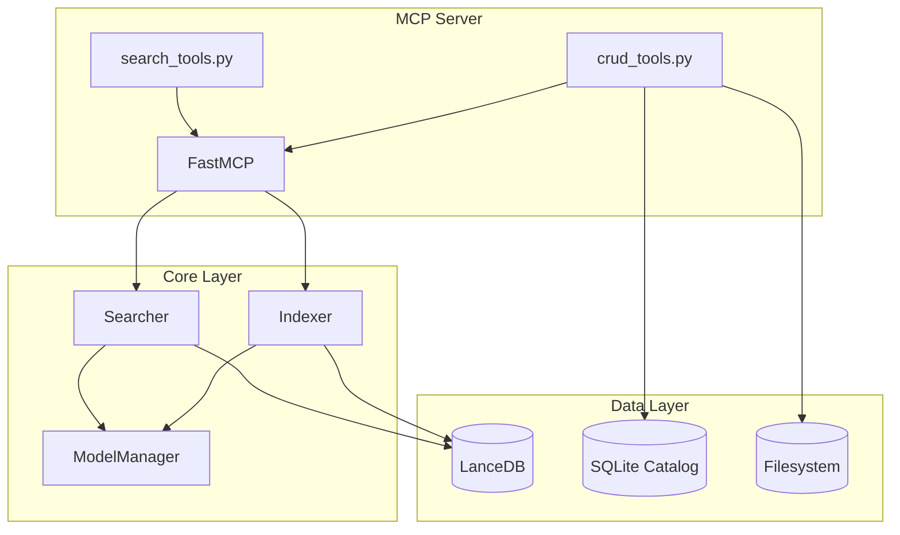
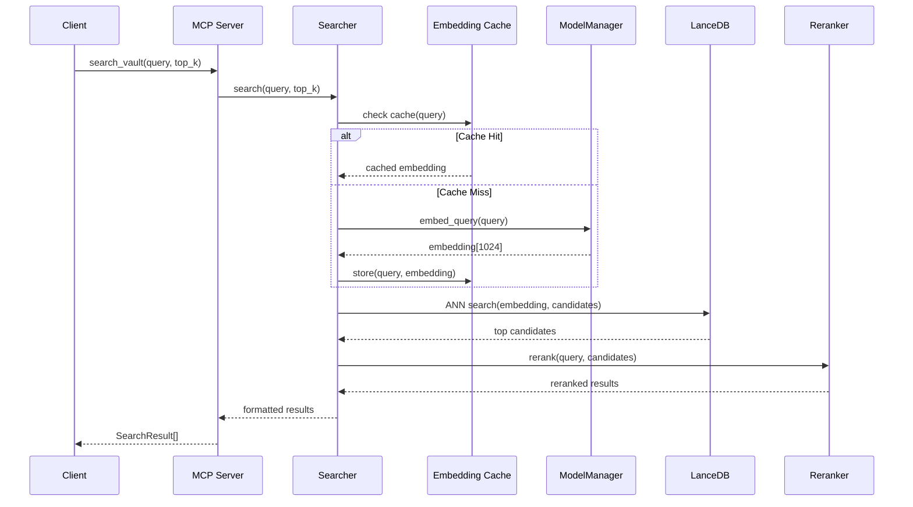
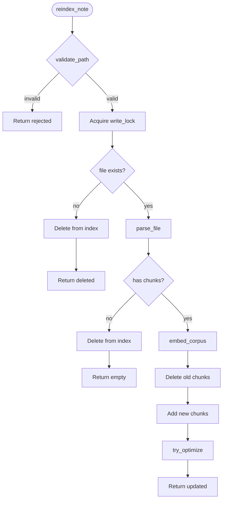
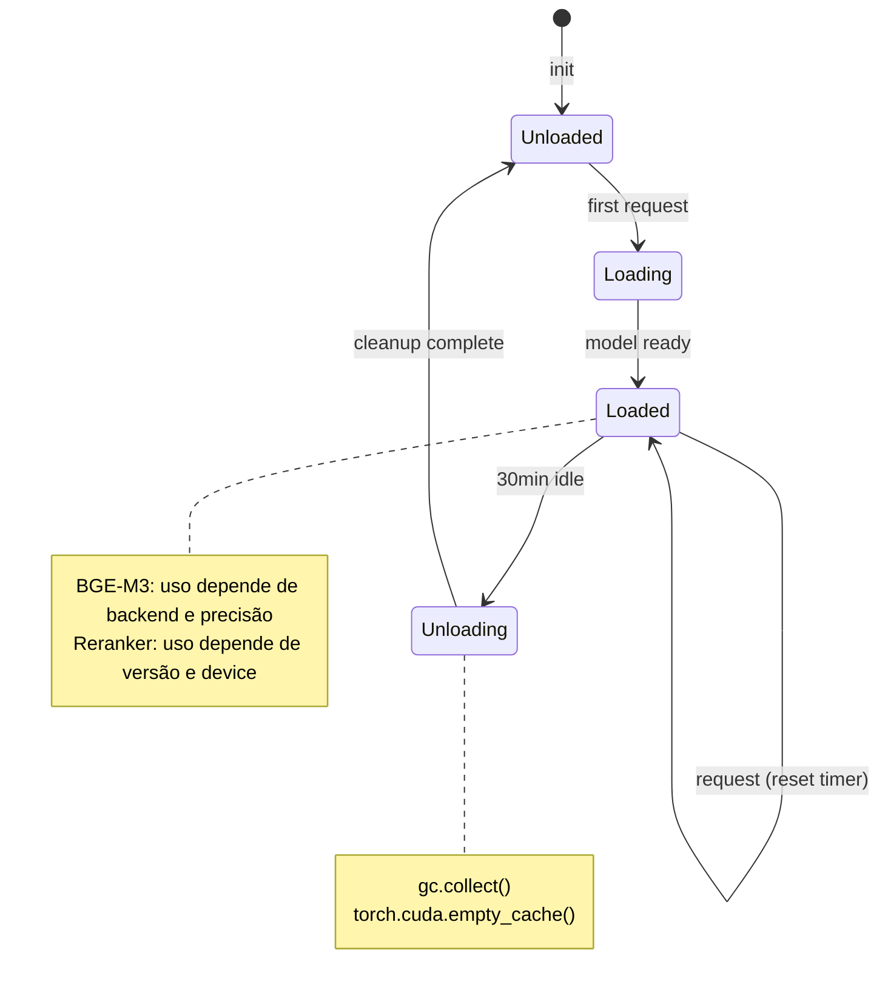

# Diagramas do núcleo

## Arquitetura geral



---

## Fluxo de busca semântica



---

## Fluxo de indexação completa

```mermaid
flowchart TB
    Start([full_reindex]) --> Scan[scan_vault]
    Scan --> |List[Path]| Pool[ThreadPoolExecutor]

    subgraph Parallel["Parallel Processing"]
        Pool --> P1[parse_file]
        Pool --> P2[parse_file]
        Pool --> P3[parse_file]
        Pool --> Pn[parse_file...]
    end

    P1 --> Batch[Batch Collector]
    P2 --> Batch
    P3 --> Batch
    Pn --> Batch

    Batch --> |500 chunks| Embed[embed_corpus]
    Embed --> Store[LanceDB.add]
    Store --> |more chunks?| Batch

    Store --> |done| FTS[create_fts_index]
    FTS --> Optimize[optimize]
    Optimize --> End([Stats])
```

---

## Fluxo de indexação incremental



---

## Busca híbrida

```mermaid
flowchart TB
    Query([Query]) --> Branch{Search Type}

    Branch -->|semantic| Vec[Vector Search]
    Branch -->|hybrid| Both[Both searches]

    Vec --> Embed[embed_query]
    Embed --> ANN[LanceDB ANN]
    ANN --> VecResults[Vector Results]

    Both --> Embed
    Both --> FTS[FTS Search]
    FTS --> FTSResults[FTS Results]

    VecResults --> Merge{Merge?}
    FTSResults --> Merge

    Merge -->|hybrid| RRF[Reciprocal Rank Fusion]
    Merge -->|semantic only| Pass[Pass through]

    RRF --> Rerank[Cross-encoder Rerank]
    Pass --> Rerank

    Rerank --> Format[Format Results]
    Format --> Output([SearchResult[]])
```

---

## Ciclo de vida do `ModelManager`


