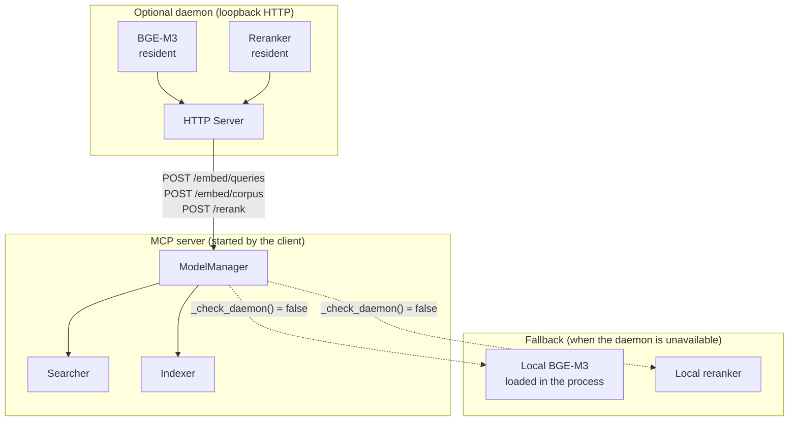
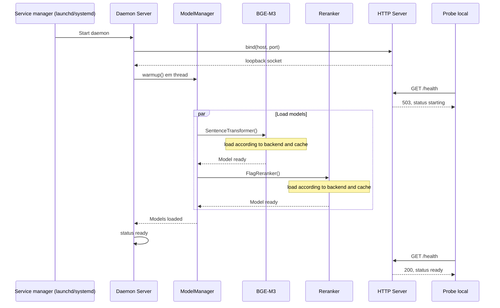
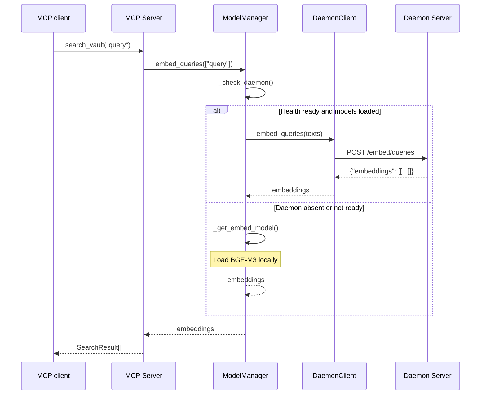
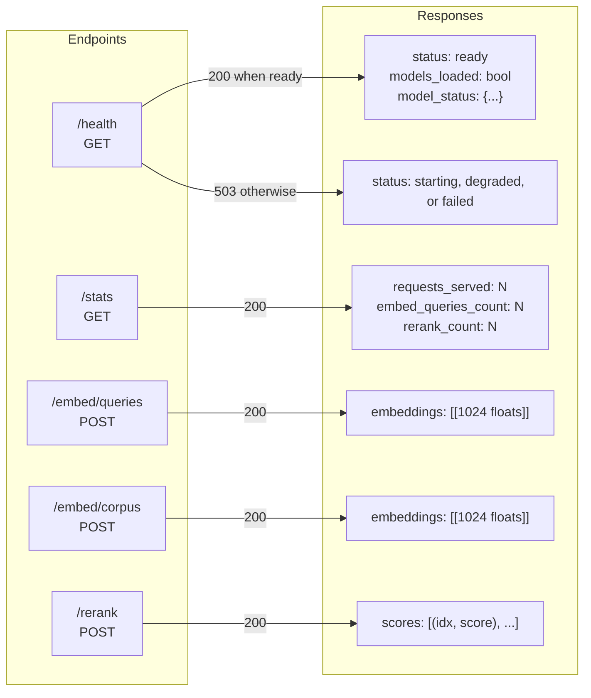
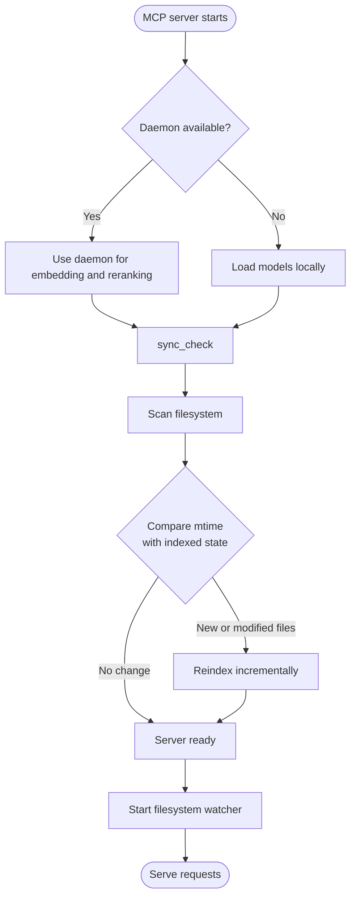

# Local daemon diagrams

## Daemon architecture

---

## Startup sequence

---

## MCP-to-daemon communication

---

## Daemon HTTP API

---

## Graceful shutdown

---

## Startup `sync_check`

