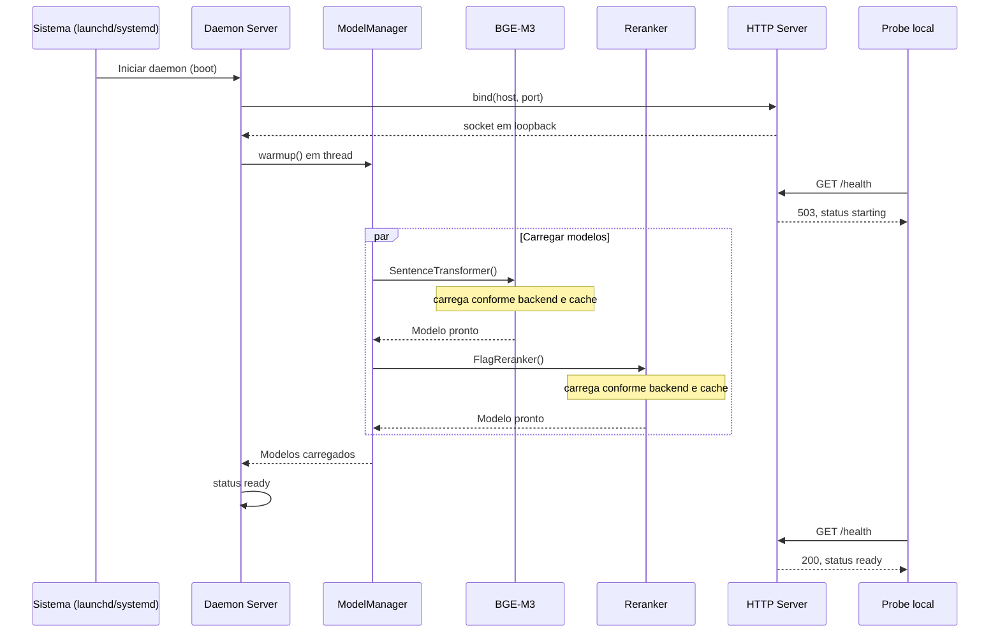
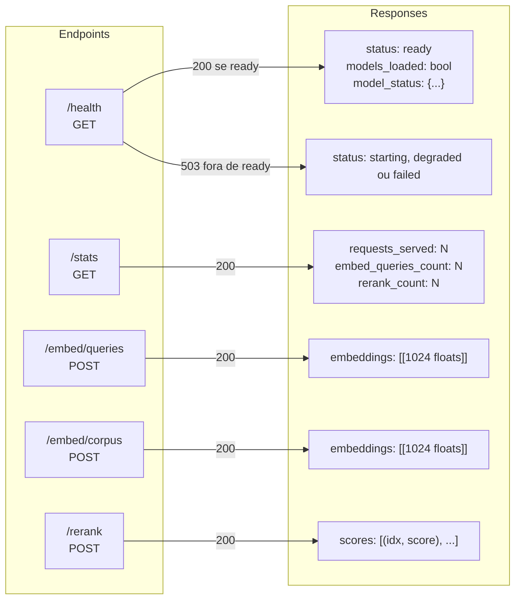
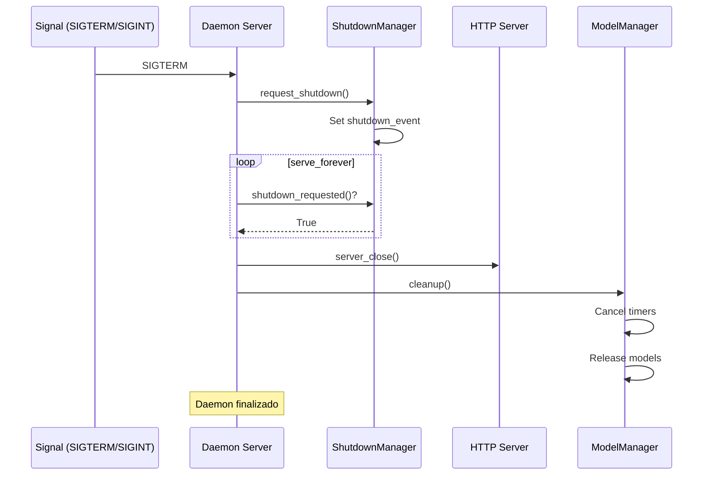
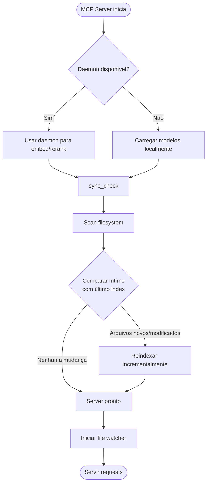

# Diagramas do daemon local

## Arquitetura do daemon

---

## Sequência de inicialização

---

## Comunicação entre MCP e daemon

---

## API HTTP do daemon

---

## Encerramento gracioso

---

## `sync_check` na inicialização

