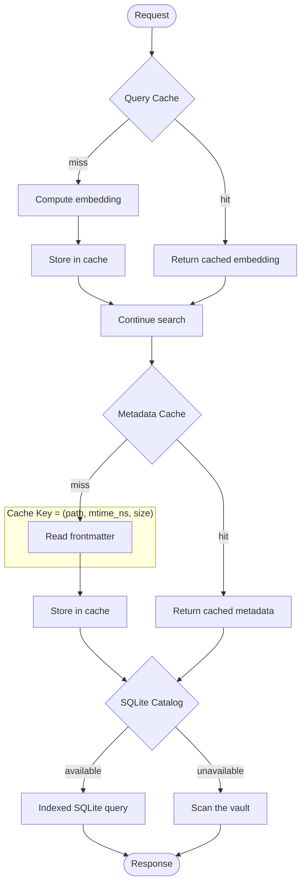
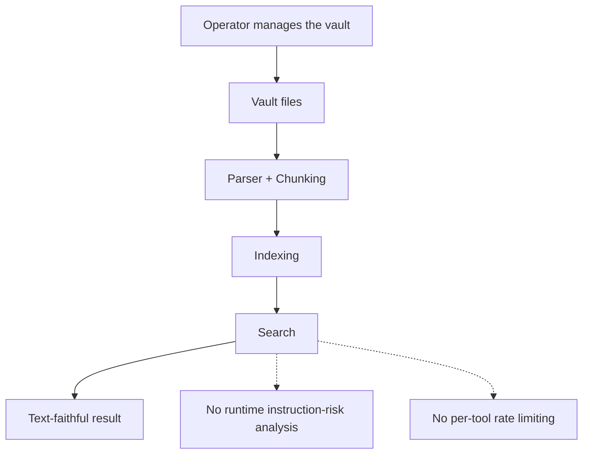
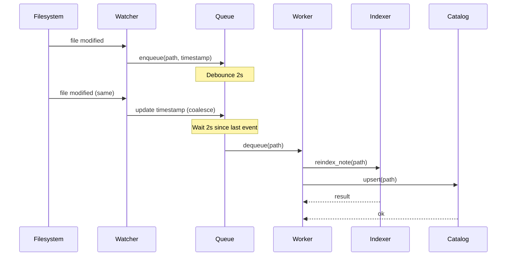
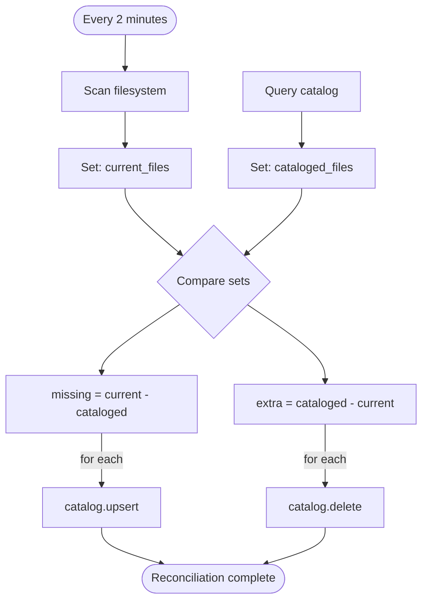
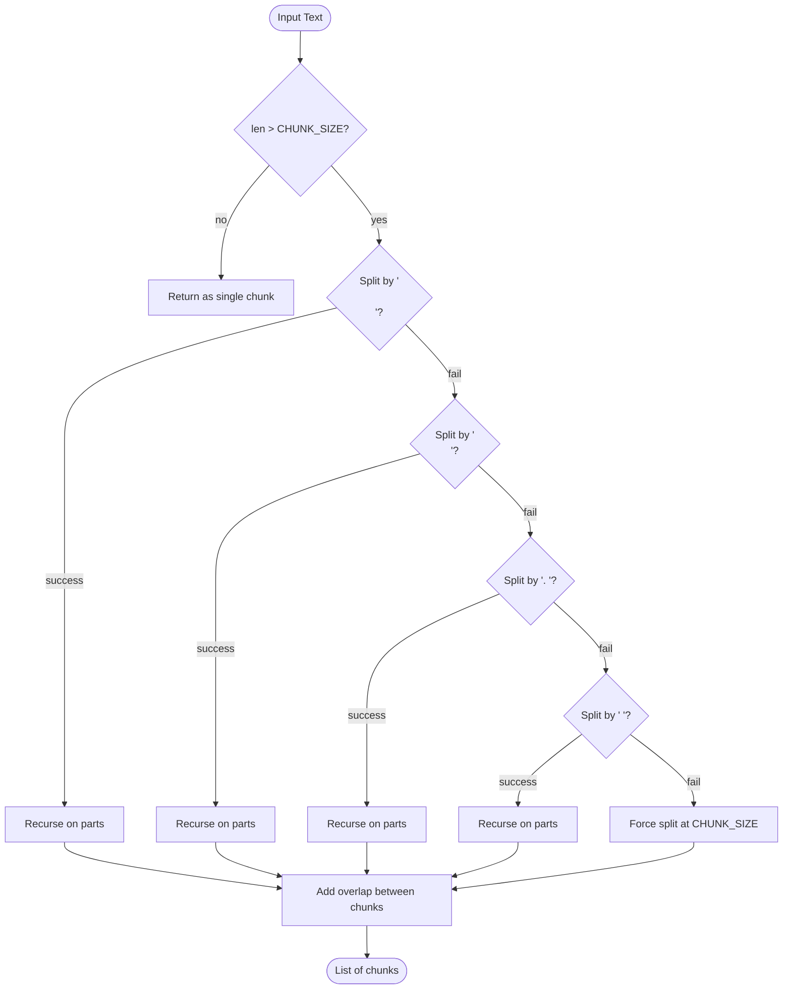
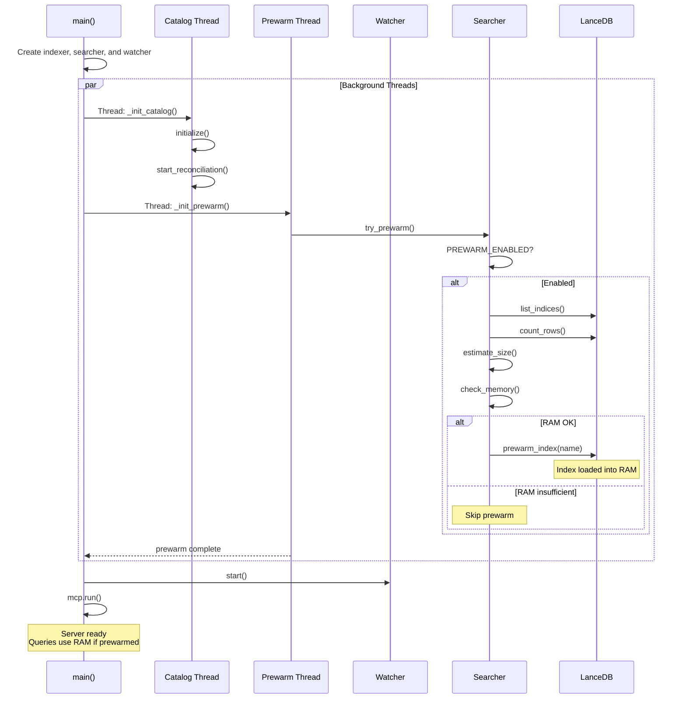
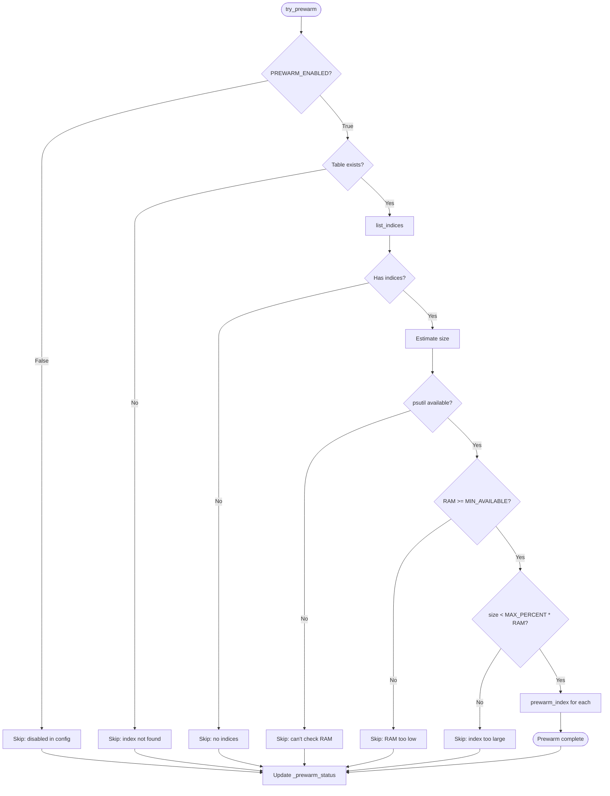
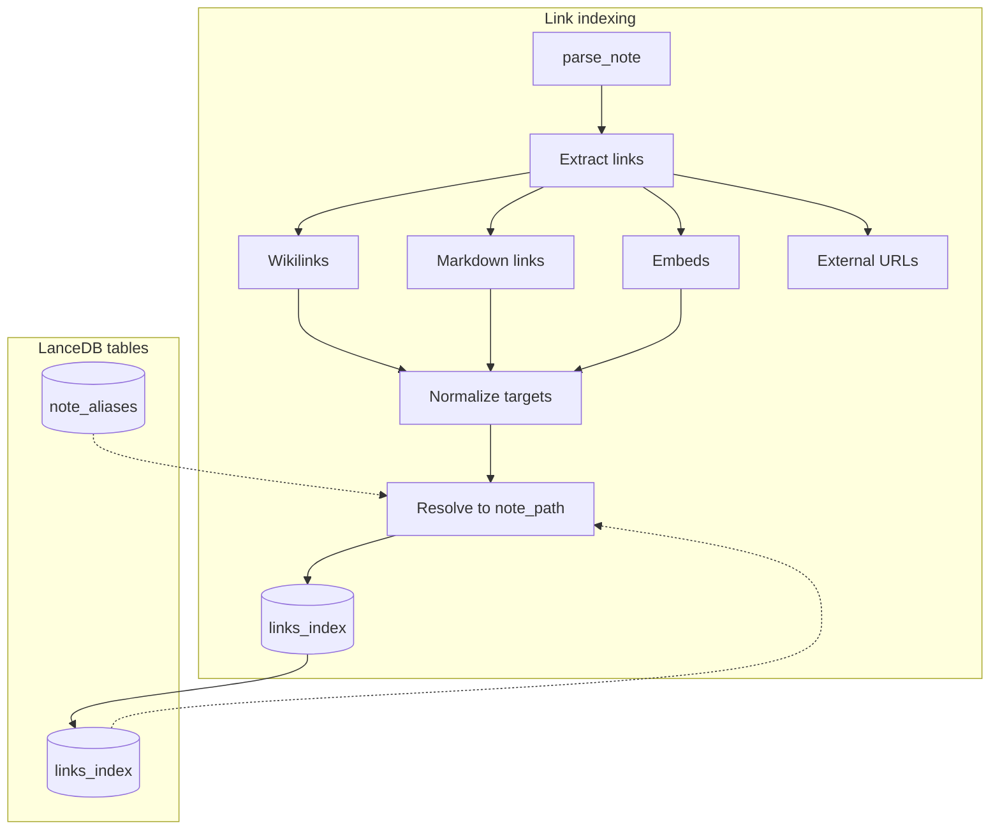
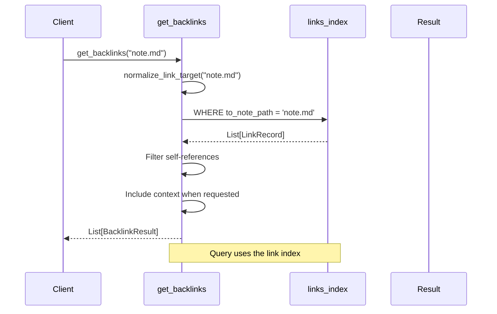
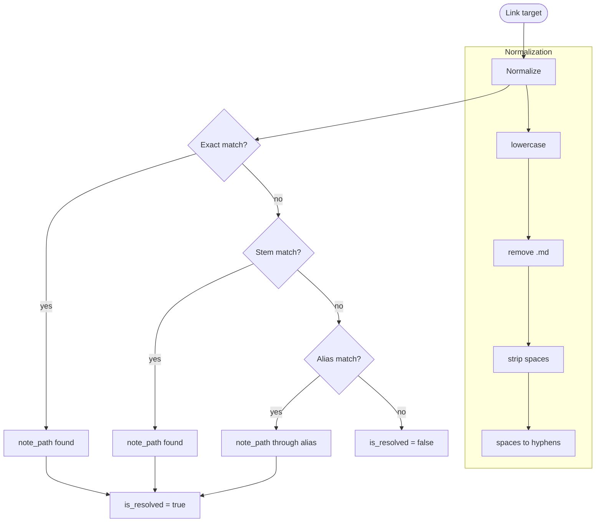

# Feature and operation diagrams

## Layered caches



---

## Data trust boundary



---

## Debounced filesystem watcher



---

## Catalog reconciliation



---

## Parsing pipeline

```mermaid
flowchart TB
    File([Input File]) --> Ext{Extension?}

    Ext -->|.md| MD[markdown.py]
    Ext -->|.canvas| Canvas[canvas.py]
    Ext -->|.pdf| PDF[pdf.py]
    Ext -->|other| Reject[Return empty]

    subgraph MarkdownParsing["Markdown Pipeline"]
        MD --> FM[Extract frontmatter]
        FM --> Tags[Extract tags]
        Tags --> Headers[Split by headers]
        Headers --> Chunk[chunk_text]
    end

    subgraph CanvasParsing["Canvas Pipeline"]
        Canvas --> Nodes[Extract text nodes]
        Nodes --> Groups[Extract group labels]
        Groups --> Edges[Extract edge labels]
        Edges --> ChunkC[chunk_text]
    end

    subgraph PDFParsing["PDF Pipeline"]
        PDF --> Pages[Extract pages]
        Pages --> OCR{Has images?}
        OCR -->|yes| Tesseract[OCR via Tesseract]
        OCR -->|no| Text[Text extraction]
        Tesseract --> ChunkP[chunk_text]
        Text --> ChunkP
    end

    Chunk --> Output([List[ChunkRecord]])
    ChunkC --> Output
    ChunkP --> Output
```

---

## Recursive chunking



---

## Server startup with prewarming



---

## Prewarm decision



---

## Indexed links



---

## `get_backlinks` flow



---

## Graph analysis

```mermaid
flowchart TB
    subgraph Tools["Graph tools"]
        GD[graph_data]
        SL[suggest_links]
        FC[find_link_clusters]
        FB[find_bridge_notes]
    end

    subgraph GraphData["graph_data()"]
        GD --> Nodes[Build nodes]
        GD --> Edges[Build edges]
        Nodes --> Stats[Calculate statistics]
        Edges --> Stats
        Stats --> JSON[Return D3.js-compatible JSON]
    end

    subgraph Clusters["find_link_clusters()"]
        FC --> Adjacency[Build adjacency]
        Adjacency --> BFS[BFS connected components]
        BFS --> Density[Calculate density]
        Density --> Rank[Sort by size]
    end

    subgraph Bridges["find_bridge_notes()"]
        FB --> Undirected[Undirected simple graph]
        Undirected --> Tarjan[Iterative Tarjan O(V + E)]
        Tarjan --> Points[Articulation points]
        Points --> TopK[Sort by separated_branches]
    end
```

---

## Link resolution


