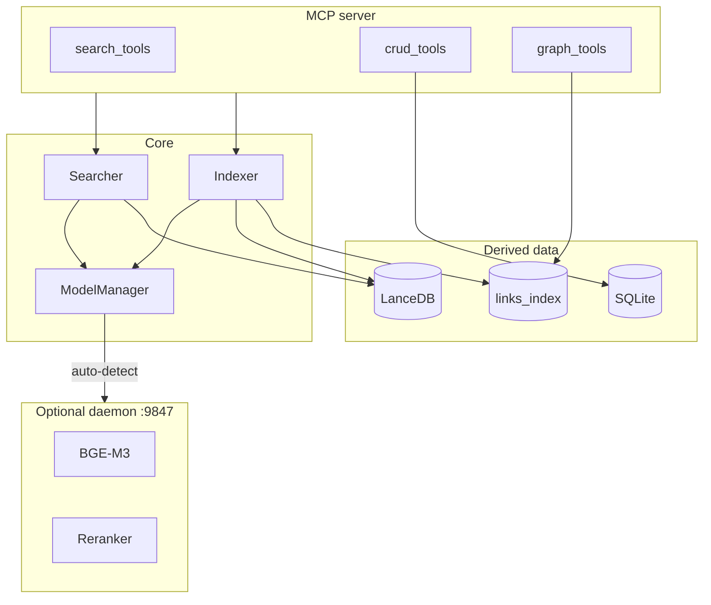

# Architecture diagrams

Mermaid diagrams are grouped by subsystem.

| File | Content |
|---|---|
| [diagrams-core.md](diagrams-core.md) | Topology, semantic search, indexing, hybrid search, model lifecycle |
| [diagrams-daemon.md](diagrams-daemon.md) | Loopback daemon, startup, MCP communication, HTTP API, shutdown |
| [diagrams-features.md](diagrams-features.md) | Cache, trust, watcher, parsing, chunking, prewarm, links, graph |

## Quick topology

## Diagram groups

### Core

- General architecture
- Semantic search flow
- Full and incremental indexing
- Hybrid search
- `ModelManager` lifecycle

### Daemon

- Daemon architecture and startup
- MCP-to-daemon communication
- Internal HTTP API
- Graceful shutdown
- Startup synchronization

### Features

- Layered caches and data trust
- Debounced filesystem watcher and catalog reconciliation
- Parsing and recursive chunking
- Server prewarming
- Indexed links, backlinks, graph analysis, and target resolution
