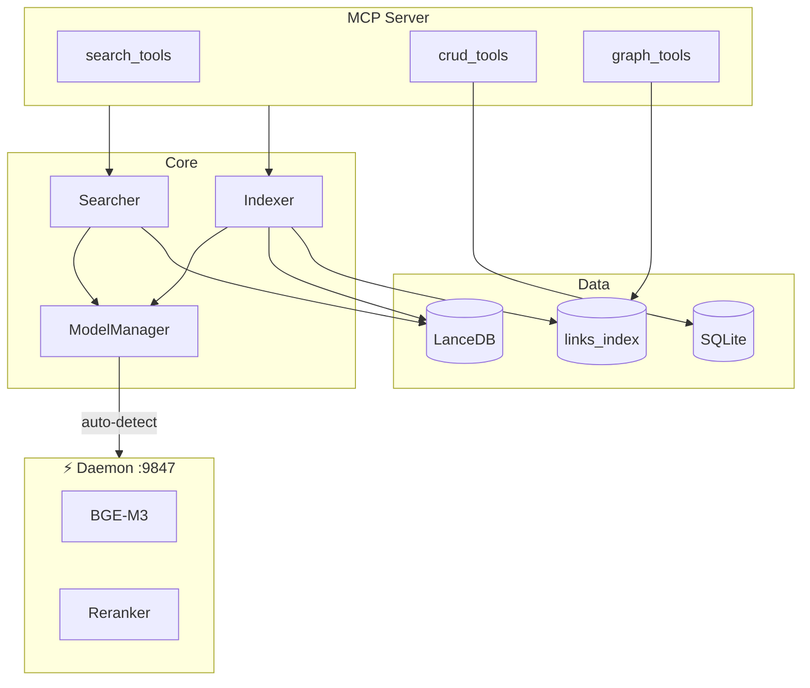

# Diagramas de arquitetura

Diagramas Mermaid do sistema vault-search-mcp, organizados por tema.

## Índice de diagramas

| Arquivo | Conteúdo |
|---------|----------|
| [diagrams-core.md](./diagrams-core.md) | Arquitetura geral, busca semântica, indexação, busca híbrida |
| [diagrams-daemon.md](./diagrams-daemon.md) | Daemon HTTP, startup, comunicação MCP↔Daemon, shutdown |
| [diagrams-features.md](./diagrams-features.md) | Cache, watcher, parsing, chunking, prewarm |

---

## Visão geral rápida

---

## Diagramas por categoria

### Core (diagrams-core.md)
- Arquitetura Geral
- Fluxo de Busca Semântica
- Fluxo de Indexação Completa
- Fluxo de Indexação Incremental
- Busca Híbrida
- ModelManager Lifecycle

### Daemon (diagrams-daemon.md)
- Daemon Architecture
- Daemon Startup Sequence
- MCP ↔ Daemon Communication
- Daemon HTTP API
- Graceful Shutdown Flow
- sync_check no Startup

### Features (diagrams-features.md)
- Sistema de Cache Multi-Camada
- Escopo de Confiança dos Dados
- File Watcher com Debounce
- Reconciliação do Catálogo
- Pipeline de Parsing
- Chunking Recursivo
- Server Startup com Prewarm
- Prewarm Decision Flow
- Sistema de Links Indexados
- Fluxo de get_backlinks
- Análise de Grafo
- Resolução de Links
