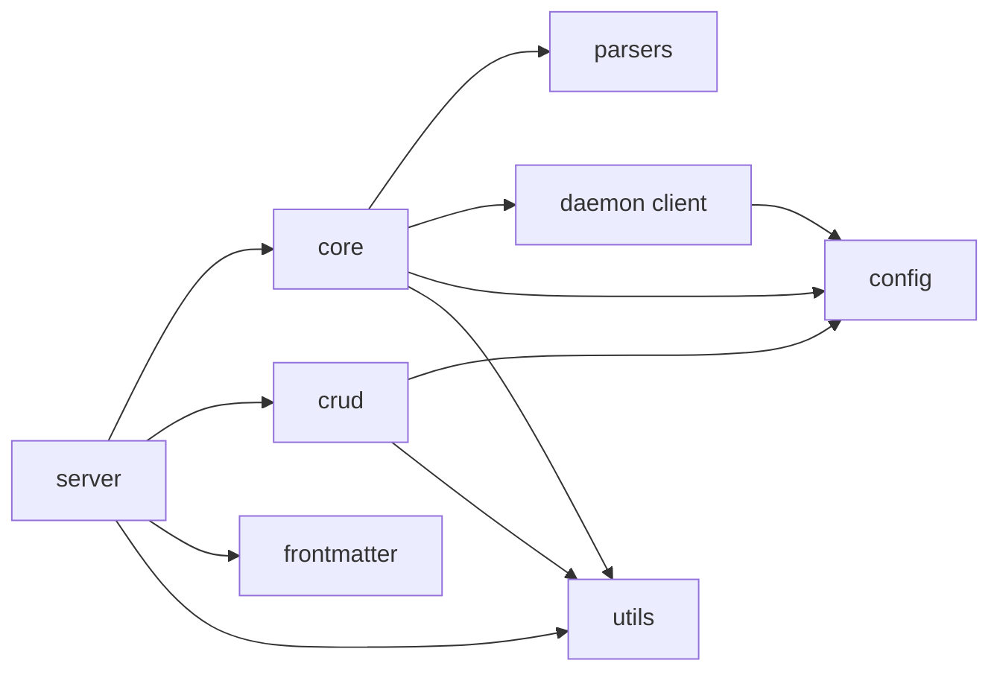

# Mapa de módulos

Este documento mostra responsabilidades e dependências principais. Ele não
declara estabilidade para símbolos internos. Os contratos públicos ficam na
[referência MCP](../api/tools.md).

## Árvore do pacote

```text
src/vault_search/
├── config/       # schema, carga YAML e snapshots compatíveis
├── core/         # scanner, chunking, modelos, indexação e busca
├── crud/         # leitura, escrita, validação e catálogo de notas
├── daemon/       # servidor HTTP local e cliente de modelos
├── frontmatter/  # schema, coerção, validação e enriquecimento opcional
├── parsers/      # Markdown, MDX, texto, PDF e Canvas
├── server/       # aplicação MCP, tools, resources e watcher
├── utils/        # logging, privacidade, retry, shutdown e helpers
├── __init__.py   # exports de compatibilidade
└── type_defs.py  # TypedDicts compartilhados
```

## `config`

| Arquivo | Responsabilidade |
|---|---|
| `settings.py` | Modelos Pydantic estritos e defaults |
| `loader.py` | Descoberta do YAML, precedência, resolução de paths e cache |
| `paths.py` | `VAULT_PATH`, `DATA_DIR`, `DB_DIR` e aliases de ambiente |
| `embedding.py` | Modelo, dimensão, device e precisão efetivos |
| `search.py` | Busca, indexação, FTS, ANN, navegação e prewarm |
| `chunking.py` | Tamanho, overlap, headers e separadores |
| `security.py` | Limites técnicos usados pelo runtime |
| `watcher.py` | Debounce, polling e timeout de encerramento |
| `pdf.py` | OCR, idiomas e DPI |

`get_config()` mantém a instância em cache. Os módulos de constantes capturam a
configuração no primeiro import para preservar consumidores existentes. Alterar
YAML ou aliases exige reiniciar o processo.

## `core`

| Arquivo | Responsabilidade |
|---|---|
| `scanner.py` | Seleção segura dos arquivos indexáveis |
| `chunker.py` | Divisão recursiva e overlap |
| `models.py` | Embedding, reranking e escolha entre daemon e processo local |
| `indexer.py` | Indexação completa, incremental, links, aliases, FTS e ANN |
| `searcher.py` | Busca vetorial, textual, híbrida e cache de queries |
| `batch_processor.py` | Embedding de lotes e montagem de registros |
| `fts_builder.py` | Criação e manutenção do índice textual |
| `highlight.py` | Destaque controlado de termos |
| `result_formatter.py` | Formatação de resultados de busca |
| `exceptions.py` | Exceções do domínio de indexação |

O índice é derivado. A reindexação completa usa staging antes de trocar a
geração canônica; a indexação incremental serializa escrita com as demais
operações do indexador.

## `crud`

| Arquivo | Responsabilidade |
|---|---|
| `validation.py` | Contenção de path, extensão, tamanho e frontmatter |
| `read.py` | Conteúdo, metadados e listagem paginada |
| `write.py` | Criação, substituição e append de notas |
| `delete.py` | Movimentação e envio recuperável para `.trash/` |
| `catalog.py` | Catálogo SQLite reconstruível |
| `cache.py` | Cache local de metadados |
| `types.py` | Tipos dos retornos CRUD |

O vault é a fonte primária. Catálogo, cache e índices podem ser reconstruídos.

## `daemon`

| Arquivo | Responsabilidade |
|---|---|
| `server.py` | HTTP em loopback, warmup, readiness, limites e watcher |
| `client.py` | Probes, cache curto de disponibilidade e chamadas de inferência |

O daemon não fala MCP. Ele mantém modelos residentes para o `ModelManager` e
aceita somente host de loopback. `/health` retorna 200 apenas em `ready`.

## `frontmatter`

| Arquivo | Responsabilidade |
|---|---|
| `schema.py` | Definição e validação de campos |
| `types.py` | Tipos do schema e dos resultados |
| `coercion.py` | Conversões explícitas de valores |
| `validator.py` | Aplicação do modo e das regras configuradas |
| `enrichment.py` | Processo externo opcional via stdin |

O enriquecimento começa desativado e só pode ser habilitado com consentimento e
provider declarados.

## `parsers`

| Arquivo | Responsabilidade |
|---|---|
| `markdown.py` | Markdown, texto e extração estrutural |
| `mdx.py` | Remoção controlada de JSX antes do parsing textual |
| `pdf.py` | Extração PyMuPDF e OCR opcional |
| `canvas.py` | Nós de texto e arquivo do Obsidian Canvas |
| `frontmatter.py` | Separação de YAML e corpo da nota |

O dispatcher fica em `parsers/__init__.py`. Formatos e operações permitidas
estão em [file-formats.md](../features/file-formats.md).

## `server`

| Arquivo | Responsabilidade |
|---|---|
| `mcp.py` | FastMCP, registro dos domínios e ciclo de vida |
| `search_tools.py` | Busca, indexação, sistema e navegação |
| `crud_tools.py` | Leitura e escrita de notas e frontmatter |
| `graph_tools.py` | Exportação, componentes e pontos de articulação |
| `resource_tools.py` | Seis resources somente de leitura |
| `watcher.py` | Worker de reindexação incremental |
| `event_handler.py` | Normalização e fila de eventos do filesystem |
| `frontmatter_jobs.py` | Fila assíncrona de enriquecimento |
| `helpers.py` | Validação e utilitários compartilhados pelas tools |
| `errors.py` | Respostas públicas sanitizadas |

O registro atual contém 43 tools e 6 resources. O gate de publicação conta os
decoradores diretamente no código.

## `utils`

| Arquivo | Responsabilidade |
|---|---|
| `logging.py` | Logging estruturado e sanitização de contexto |
| `privacy.py` | Redação recursiva de valores sensíveis |
| `security.py` | Escape de SQL e validações auxiliares |
| `network.py` | Identificação de endereços de loopback |
| `shutdown.py` | Sinais, callbacks e seções protegidas |
| `retry.py` | Retry limitado e circuit breaker |
| `metrics.py` | Medições locais e health agregado |
| `links.py` | Extração e normalização de links |
| `chunking.py` | Helpers de lote e coleta |
| `metadata.py` | Metadados de arquivo e título |
| `math.py` | Normalização de vetores |
| `uuid.py` | Geração e validação de UUID v7 |

## Direção das dependências



Evite importar `server` a partir das camadas inferiores. Configuração e helpers
podem ser compartilhados, mas efeitos de inicialização devem permanecer nos
entry points.
