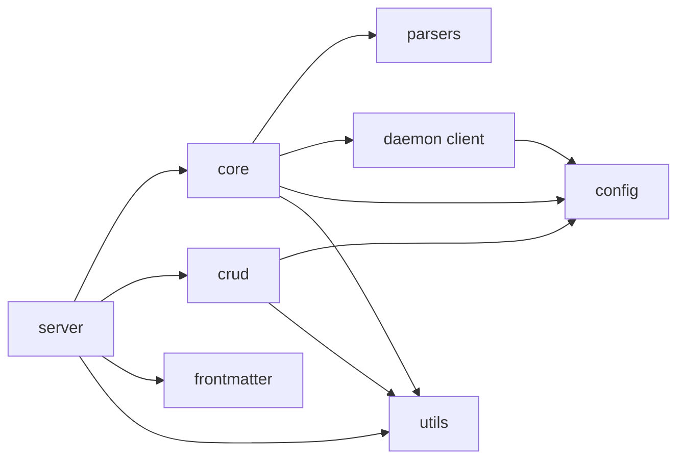

# Module map

This page describes responsibilities and primary dependencies. It does not
promise stability for internal symbols. Public contracts live in the
[MCP reference](../api/tools.md).

## Package tree

```text
src/vault_search/
├── config/       # schema, YAML loading, and compatible snapshots
├── core/         # scanner, chunking, models, indexing, and search
├── crud/         # note reads, writes, validation, and catalog
├── daemon/       # local HTTP model server and client
├── frontmatter/  # schema, coercion, validation, and optional enrichment
├── parsers/      # Markdown, MDX, text, PDF, and Canvas
├── server/       # MCP application, tools, resources, and lifecycle
├── utils/        # logging, privacy, retries, shutdown, and helpers
├── watching/     # filesystem events and incremental reindexing
├── __init__.py   # compatibility exports
└── type_defs.py  # shared TypedDict contracts
```

## `config`

| File | Responsibility |
|---|---|
| `settings.py` | Strict Pydantic models and defaults |
| `loader.py` | YAML discovery, precedence, path resolution, and cache |
| `paths.py` | `VAULT_PATH`, `DATA_DIR`, `DB_DIR`, and environment aliases |
| `embedding.py` | Effective model, dimension, device, and precision |
| `search.py` | Search, indexing, FTS, ANN, navigation, and prewarm constants |
| `chunking.py` | Size, overlap, headers, and separators |
| `security.py` | Runtime technical limits |
| `watcher.py` | Debounce, polling, and shutdown timeout |
| `pdf.py` | OCR, languages, and DPI |

`get_config()` caches one instance. Compatibility constant modules capture
configuration on first import. Restart after changing YAML or aliases.

## `core`

| File | Responsibility |
|---|---|
| `scanner.py` | Safe selection of indexable files |
| `chunker.py` | Recursive splitting with overlap |
| `models.py` | Embedding, reranking, and daemon/local selection |
| `indexer.py` | Full and incremental indexing, links, aliases, FTS, and ANN |
| `searcher.py` | Vector, text, and hybrid retrieval plus query cache |
| `batch_processor.py` | Batched embedding and record assembly |
| `fts_builder.py` | Full-text index creation and maintenance |
| `highlight.py` | Bounded term highlighting |
| `result_formatter.py` | Search response formatting |
| `exceptions.py` | Indexing domain exceptions |

The index is derived. Full rebuilds stage a replacement before changing the
canonical generation. Incremental indexing shares write serialization with
other indexer operations.

## `crud`

| File | Responsibility |
|---|---|
| `validation.py` | Path containment, extensions, size, and frontmatter |
| `read.py` | Content, metadata, and paginated listing |
| `write.py` | Create, replace, append, and enrichment persistence |
| `delete.py` | Movement, rename, and recoverable `.trash/` behavior |
| `catalog.py` | Rebuildable SQLite catalog |
| `cache.py` | Local metadata cache |
| `types.py` | CRUD response types |

The vault is primary. Catalog, cache, and indexes are rebuildable.

## `daemon`

| File | Responsibility |
|---|---|
| `server.py` | Loopback HTTP, warmup, readiness, limits, and watcher |
| `client.py` | Probes, short availability cache, and inference calls |

The daemon does not speak MCP. It keeps models resident for `ModelManager`,
accepts loopback hosts only, and returns HTTP 200 from `/health` only when
`ready`.

## `frontmatter`

| File | Responsibility |
|---|---|
| `schema.py` | Field definition and validation |
| `types.py` | Schema and result types |
| `coercion.py` | Explicit value conversions |
| `validator.py` | Mode and rule application |
| `enrichment.py` | Optional external process over `stdin` |

Enrichment starts disabled and requires explicit consent plus a declared
provider.

## `parsers`

| File | Responsibility |
|---|---|
| `markdown.py` | Markdown, text, and structural extraction |
| `mdx.py` | Controlled JSX removal before text parsing |
| `pdf.py` | PyMuPDF extraction and optional OCR |
| `canvas.py` | Obsidian Canvas text nodes, file nodes, and labels |
| `frontmatter.py` | YAML/body separation |

The dispatcher lives in `parsers/__init__.py`. See
[file formats](../features/file-formats.md).

## `server`

| File | Responsibility |
|---|---|
| `mcp.py` | FastMCP, domain registration, and lifecycle |
| `search_tools.py` | Search, indexing, system, and navigation tools |
| `crud_tools.py` | Note and frontmatter reads and writes |
| `graph_tools.py` | Graph export, components, and articulation points |
| `resource_tools.py` | Six read-only resources |
| `frontmatter_jobs.py` | Asynchronous enrichment queue |
| `helpers.py` | Shared tool validation and utilities |
| `errors.py` | Sanitized public failures |

The current registry contains 43 tools and 6 resources. Publication checks
count decorators directly.

## `watching`

| File | Responsibility |
|---|---|
| `watcher.py` | Incremental reindex worker and catalog reconciliation |
| `event_handler.py` | Filesystem event normalization and coalescing |

The package initializer has no runtime imports. CRUD operations can register
internal file revisions without loading index or MCP modules.

## `utils`

| File | Responsibility |
|---|---|
| `logging.py` | Structured logs and context sanitization |
| `privacy.py` | Recursive sensitive-value redaction |
| `security.py` | SQL escaping and auxiliary validation |
| `network.py` | Loopback-address recognition |
| `shutdown.py` | Signals, callbacks, and protected sections |
| `retry.py` | Bounded retries and circuit breaker |
| `metrics.py` | Local measurements and aggregate health |
| `links.py` | Link extraction and normalization |
| `chunking.py` | Batch and collection helpers |
| `metadata.py` | File metadata and title helpers |
| `math.py` | Vector normalization |
| `uuid.py` | UUID v7 generation and validation |

## Dependency direction



Lower layers should not import `server`. Configuration and helpers can be
shared, but initialization effects belong in entry points.
