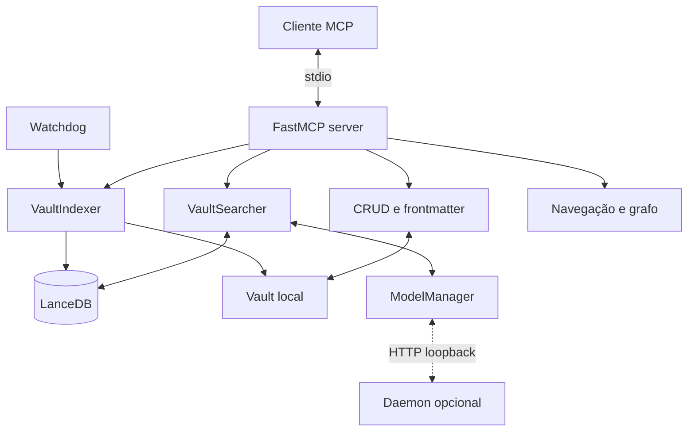
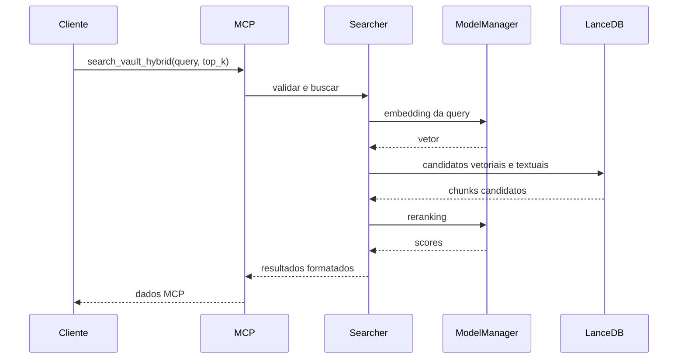

# Visão arquitetural

## Componentes

## Fluxo de indexação

1. O scanner seleciona extensões permitidas e ignora pastas configuradas.
2. Cada parser produz chunks, links e aliases.
3. O ModelManager gera embeddings localmente ou pelo daemon.
4. O indexador grava a nova geração e seus índices de consulta.
5. O catálogo e o watcher mantêm metadados auxiliares sincronizados.

O vault é fonte primária. LanceDB, FTS e SQLite são derivados reconstruíveis.

## Fluxo de busca

## Estado e concorrência

O servidor mantém indexer, searcher e watcher compartilhados. Inicializações de
catálogo, prewarm, modelos e sync podem ocorrer em background. Qualquer mudança
nessa sequência precisa considerar contenção de CPU, memória, banco e shutdown.

## Configuração

`VaultSearchConfig` agrega objetos Pydantic por domínio. A precedência e os
overrides estão em [../config/yaml.md](../config/yaml.md). Módulos legados de
constantes ainda existem para compatibilidade e devem convergir para o mesmo
objeto validado.

## Fronteiras

| Fronteira | Transporte | Regra |
|---|---|---|
| Cliente para servidor | MCP stdio | Input validado e erro sanitizado |
| Servidor para vault | Sistema de arquivos | Path contido e escrita atômica |
| Servidor para índice | APIs locais | Geração anterior preservada até commit |
| Servidor para daemon | HTTP loopback | Health semântico, limite e timeout |
| Servidor para processo externo | stdin explícito | Desativado por padrão e consentido |

Veja [../security/threat-model.md](../security/threat-model.md).

## Organização do código

| Pacote | Responsabilidade |
|---|---|
| `config` | Schema, carga e constantes compatíveis |
| `core` | Scanner, parsing coordenado, indexação e busca |
| `crud` | Operações e catálogo de notas |
| `frontmatter` | Schema e validação de metadados |
| `parsers` | Markdown, MDX, texto, PDF e Canvas |
| `server` | Tools, resources, watcher e lifecycle MCP |
| `daemon` | Modelos persistentes em loopback |
| `utils` | Logging, retry, UUID e shutdown |

O mapa detalhado está em [modules.md](modules.md).
