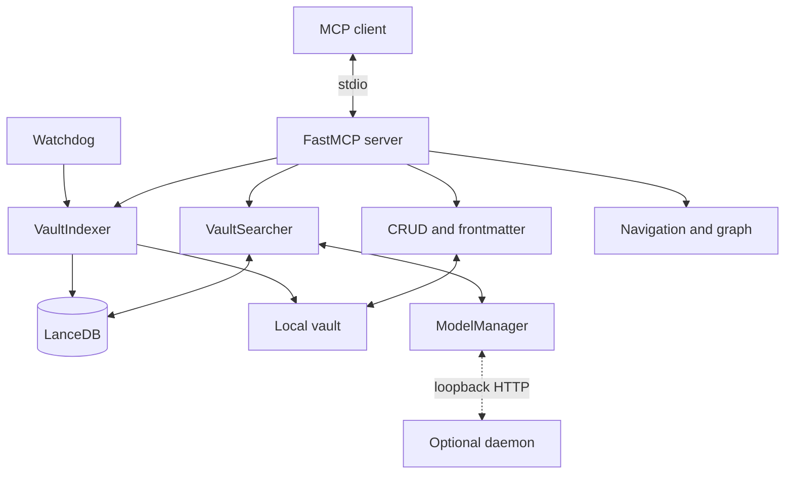
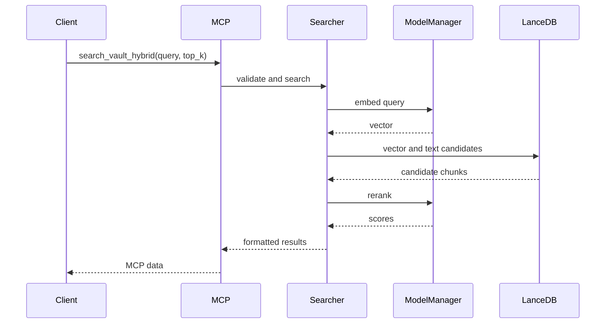

# Architecture overview

## Components

## Indexing flow

1. The scanner selects enabled extensions and excludes configured folders.
2. Each parser emits chunks, links, and aliases.
3. `ModelManager` generates embeddings locally or through the daemon.
4. The indexer commits a new generation and query indexes.
5. The catalog and watcher maintain auxiliary metadata.

The vault is primary. LanceDB, FTS, and SQLite are rebuildable derivatives.

## Search flow

## State and concurrency

The server shares one indexer, searcher, and watcher. Catalog initialization,
prewarming, models, and synchronization can run in the background. Changes to
startup order must account for CPU, memory, database contention, and shutdown.

## Configuration

`VaultSearchConfig` aggregates domain-specific Pydantic models. Precedence and
overrides are documented in [../config/yaml.md](../config/yaml.md). Legacy
constant modules still exist for compatibility and converge on the same
validated object.

## Boundaries

| Boundary | Transport | Rule |
|---|---|---|
| Client to server | MCP `stdio` | Validate input and sanitize failures |
| Server to vault | Filesystem | Contain paths and use atomic writes |
| Server to index | Local APIs | Preserve the active generation until commit |
| Server to daemon | Loopback HTTP | Semantic health, size bounds, and timeouts |
| Server to external process | Explicit `stdin` | Disabled by default and consent-gated |

See the [threat model](../security/threat-model.md).

## Code organization

| Package | Responsibility |
|---|---|
| `config` | Schema, loading, and compatible constants |
| `core` | Scanning, coordinated parsing, indexing, and search |
| `crud` | Note operations and catalog |
| `frontmatter` | Metadata schema and validation |
| `parsers` | Markdown, MDX, text, PDF, and Canvas |
| `server` | MCP tools, resources, jobs, and lifecycle |
| `daemon` | Persistent loopback model process |
| `utils` | Logging, retries, UUIDs, and shutdown |
| `watching` | Filesystem events and incremental reindexing |

See [modules.md](modules.md) for the detailed map.
