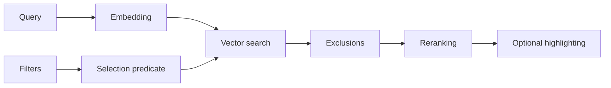

# Faceted search

`search_advanced` combines semantic similarity with structured fields stored in
the index. Use it when retrieval must respect folder, file type, modification
date, or frontmatter metadata.

## Flow



Filters apply during vector search. `exclude` removes candidates before
reranking. Highlighting touches final results only.

## MCP call

```python
search_advanced(
    query="architecture decisions",
    top_k=10,
    tags=["architecture", "decision"],
    folder="projects/atlas",
    extension="md",
    date_range="month",
    status="published",
    note_type="meeting",
    category="work",
    project="atlas",
    exclude=["cancelled"],
    highlight=True,
)
```

Only `query` is required. Active filters combine with AND. `tags` is the
exception and uses OR among supplied tags.

## Parameters

| Parameter | Contract |
|---|---|
| `query` | Semantic query; whitespace-only input is rejected |
| `top_k` | Final result count, clamped to configured limits |
| `tags` | Match when at least one tag occurs in the indexed field |
| `folder` | Exact folder plus descendants |
| `extension` | Accepts `md` and `.md` forms for an enabled extension |
| `date_range` | `today`, `week`, `month`, or `year` |
| `date_from`, `date_to` | ISO bounds used when `date_range` is absent |
| `status` | Equality after lowercase normalization |
| `note_type` | Equality after lowercase normalization |
| `category` | Partial match in the normalized category field |
| `project` | Equality against the indexed project |
| `exclude` | Remove results containing any listed term |
| `highlight` | Mark meaningful query terms with `**` |

Unsupported extensions are rejected. The server also bounds query size,
`top_k`, and exclusion count.

## Dates

Date filters use filesystem `modified_at` captured during indexing. They do not
filter frontmatter `created_at` or `updated_at`.

| Value | Moving window |
|---|---|
| `today` | Last 24 hours |
| `week` | Last 7 days |
| `month` | Last 30 days |
| `year` | Last 365 days |

Explicit bounds accept `YYYY-MM-DD` or ISO datetime values:

```python
search_advanced(
    query="retrospective",
    date_from="2026-01-01",
    date_to="2026-03-31T23:59:59",
)
```

When `date_range` is present, explicit bounds are ignored. Invalid date values
are ignored and recorded in local logs.

## Folders, extensions, and tags

`folder="projects"` includes `projects` and `projects/subfolder`, but excludes
`projects-archive`. Result paths remain relative to the vault.

Default extensions are `.md`, `.mdx`, `.txt`, `.pdf`, and `.canvas`. Changing
`indexing.extensions` changes the set accepted by both indexer and tool.

Tags are stored in a textual field. Any supplied tag can satisfy the filter:

```python
search_advanced(
    query="authentication",
    tags=["security", "identity"],
    folder="engineering",
)
```

## Indexed frontmatter fields

Missing values become empty strings.

| Index field | Accepted YAML names | Normalization |
|---|---|---|
| `id` | `id` | Text |
| `created_at` | `created_at`, `created`, `date` | ISO text capped at 19 characters |
| `updated_at` | `updated_at`, `updated`, `modified` | ISO text capped at 19 characters |
| `description` | `description`, `summary`, `excerpt` | Text capped at 500 characters |
| `status` | `status` | Lowercase, outer whitespace removed |
| `note_type` | `note_type`, `type` | Lowercase, outer whitespace removed |
| `category` | `category`, `categories` | List rendered as lowercase text |
| `project` | `project` | Outer whitespace removed |
| `source` | `source`, `url`, `link` | Text capped at 500 characters |

Extraction accepts free text for `status`, `note_type`, `category`, and
`project`. Enable the [frontmatter schema](frontmatter-schema.md) to enforce
types, enums, or required fields.

## Result and limits

The result uses the semantic-search shape: path, title, section, text, score,
and available indexed metadata. Reranking defines final order when enabled.

An empty list means no candidate passed every active filter. Internal failures
use the sanitized public form in [API errors](../api/errors.md).

Current limits:

- no aggregate counts per facet;
- date filters use filesystem modification time;
- category uses partial text matching;
- tags use text matching rather than a relational table;
- semantic quality depends on models, language, and vault content.

When results are unexpectedly narrow, begin with `query` alone and add one
filter at a time. Check metadata, validate frontmatter, and call `reindex_note`
after a correction. Use `vault_stats` and `vector_index_status` to inspect index
coverage.
