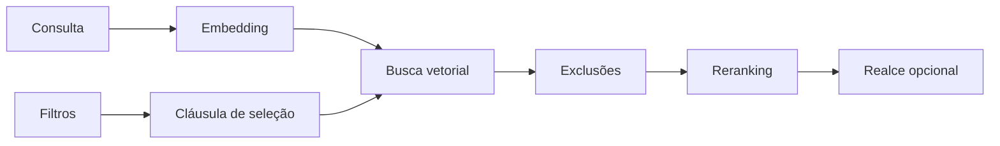

# Busca facetada

`search_advanced` combina similaridade semântica com filtros armazenados no
índice. Use a ferramenta quando a consulta precisa respeitar pasta, tipo de
arquivo, datas ou metadados do frontmatter.

## Fluxo



Os filtros são aplicados durante a busca vetorial. Termos de `exclude` removem
candidatos antes do reranking. O realce, quando pedido, é aplicado somente aos
resultados finais.

## Chamada MCP

```python
search_advanced(
    query="decisões de arquitetura",
    top_k=10,
    tags=["architecture", "decision"],
    folder="projects/atlas",
    extension="md",
    date_range="month",
    status="published",
    note_type="meeting",
    category="work",
    project="atlas",
    exclude=["cancelled"],
    highlight=True,
)
```

Somente `query` é obrigatória. Filtros ativos são combinados com `AND`, com a
exceção de `tags`, que usa `OR` entre os itens da lista.

## Parâmetros

| Parâmetro | Tipo | Comportamento |
|---|---|---|
| `query` | `str` | Consulta semântica. Espaços isolados são rejeitados. |
| `top_k` | `int` | Quantidade final, limitada pelo servidor ao intervalo permitido. |
| `tags` | `list[str]` | Aceita a nota quando ao menos uma tag aparece no campo indexado. |
| `folder` | `str` | Inclui a pasta exata e suas subpastas. |
| `extension` | `str` | Aceita valor com ou sem ponto: `md` e `.md` são equivalentes. |
| `date_range` | `str` | Janela relativa: `today`, `week`, `month` ou `year`. |
| `date_from` | `str` | Limite inicial ISO, usado quando `date_range` não foi informado. |
| `date_to` | `str` | Limite final ISO, usado quando `date_range` não foi informado. |
| `status` | `str` | Igualdade, depois de normalização para minúsculas. |
| `note_type` | `str` | Igualdade, depois de normalização para minúsculas. |
| `category` | `str` | Correspondência parcial no campo de categorias. |
| `project` | `str` | Igualdade com o projeto indexado. |
| `exclude` | `list[str]` | Remove resultados cujo texto contém algum termo. |
| `highlight` | `bool` | Destaca termos da consulta no texto retornado. |

Uma extensão fora da lista configurada é rejeitada. O servidor também limita o
tamanho da consulta, `top_k` e a quantidade de termos excluídos. Consulte
[Configuração YAML](../config/yaml.md) para alterar extensões indexáveis.

## Datas

As datas filtram `modified_at`, obtido do sistema de arquivos durante a
indexação. Elas não filtram `created_at` nem `updated_at` do frontmatter.

As janelas relativas usam o relógio local do processo:

| Valor | Intervalo móvel |
|---|---|
| `today` | últimas 24 horas |
| `week` | últimos 7 dias |
| `month` | últimos 30 dias |
| `year` | últimos 365 dias |

Para um intervalo explícito, use ISO `YYYY-MM-DD` ou
`YYYY-MM-DDTHH:MM:SS`:

```python
search_advanced(
    query="retrospectiva",
    date_from="2026-01-01",
    date_to="2026-03-31T23:59:59",
)
```

Se `date_range` estiver presente, `date_from` e `date_to` são ignorados. Uma
data inválida é ignorada e registrada no log local.

## Pastas, extensões e tags

O filtro `folder="projects"` aceita `projects` e `projects/subfolder`, mas não
aceita `projects-archive`. Caminhos de resultado permanecem relativos ao vault.

As extensões públicas suportadas pela configuração padrão são `.md`, `.mdx`,
`.txt`, `.pdf` e `.canvas`. Alterar `vault.extensions` muda a lista aceita pela
ferramenta e pelo indexador.

As tags são armazenadas em um campo textual. A busca aceita qualquer uma das
tags informadas:

```python
search_advanced(
    query="autenticação",
    tags=["security", "identity"],
    folder="engineering",
)
```

## Campos de frontmatter indexados

O parser extrai os campos abaixo. Valores ausentes são indexados como string
vazia.

| Campo no índice | Nomes aceitos no YAML | Normalização |
|---|---|---|
| `id` | `id` | Texto. |
| `created_at` | `created_at`, `created`, `date` | Texto ISO, limitado a 19 caracteres. |
| `updated_at` | `updated_at`, `updated`, `modified` | Texto ISO, limitado a 19 caracteres. |
| `description` | `description`, `summary`, `excerpt` | Texto limitado a 500 caracteres. |
| `status` | `status` | Minúsculas e espaços externos removidos. |
| `note_type` | `note_type`, `type` | Minúsculas e espaços externos removidos. |
| `category` | `category`, `categories` | Lista convertida em texto; resultado em minúsculas. |
| `project` | `project` | Espaços externos removidos. |
| `source` | `source`, `url`, `link` | Texto limitado a 500 caracteres. |

`status`, `note_type`, `category` e `project` aceitam texto livre durante a
extração. Para impor tipos, enumerações ou campos obrigatórios, habilite o
[schema de frontmatter](frontmatter-schema.md).

## Exemplos focais

### Pasta e período

```python
search_advanced(
    query="risco de migração",
    folder="projects/atlas",
    date_range="week",
)
```

### Tipo e estado

```python
search_advanced(
    query="próximas ações",
    note_type="meeting",
    status="published",
)
```

### Exclusão e realce

```python
search_advanced(
    query="API de pagamentos",
    exclude=["deprecated", "cancelled"],
    highlight=True,
)
```

O realce modifica o campo de texto devolvido e usa `**` como marcador interno.
A ferramenta MCP não expõe marcadores personalizados.

## Resultado

A resposta segue o mesmo formato das demais buscas semânticas. Cada item pode
conter caminho da nota, título, seção, texto, score e metadados indexados. A
ordem final vem do reranker quando ele está disponível no modo de execução.

Uma lista vazia significa que nenhum candidato passou por todos os filtros.
Falhas internas retornam a mensagem pública sanitizada descrita em
[Erros da API](../api/errors.md).

## Limitações atuais

- A ferramenta não agrega contagens por faceta.
- O filtro de data usa `modified_at` do arquivo.
- `category` usa correspondência parcial em um campo textual.
- A busca por tags usa correspondência textual, não uma tabela relacional.
- A qualidade semântica depende dos modelos, do idioma e do conteúdo do vault.

Esses limites descrevem o comportamento atual. Medidas de latência e qualidade
devem seguir o [protocolo de benchmark](../performance/benchmarking.md) e citar
hardware, versão, tamanho do índice e conjunto de consultas.

## Diagnóstico

Quando uma consulta retorna menos resultados do que o esperado:

1. rode a mesma busca apenas com `query`;
2. adicione um filtro por vez;
3. confira os metadados com `get_note_metadata`;
4. valide o frontmatter com `validate_frontmatter`;
5. use `reindex_note` após corrigir metadados ou conteúdo.

Para conferir a cobertura do índice, use `vault_stats` e
`vector_index_status`. O guia de [solução de problemas](../operation/troubleshooting.md)
traz o fluxo completo para índice ausente ou desatualizado.
