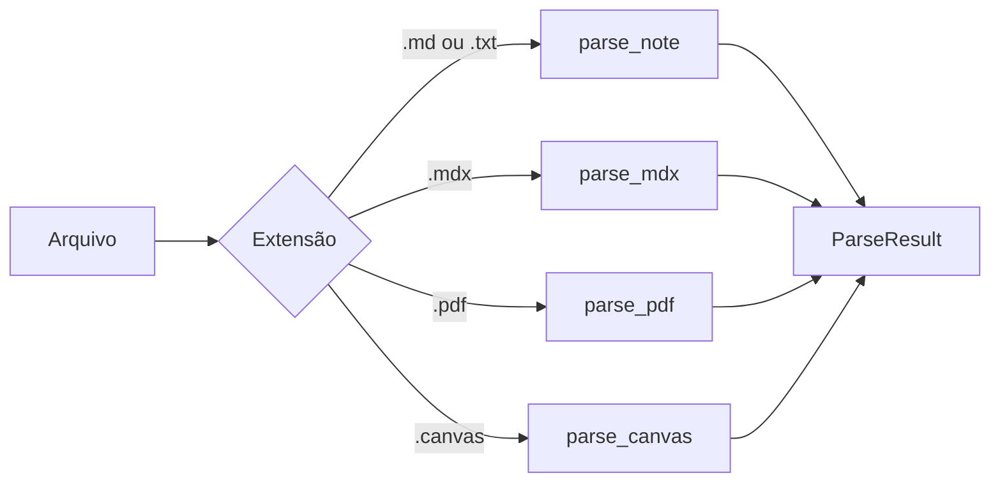

# Formatos de arquivo

A configuração pública indexa cinco extensões. Adicionar uma extensão ao YAML
sem implementar parser não cria suporte novo.

| Formato | Parser | Texto indexado | Limites principais |
|---|---|---|---|
| `.md` | `markdown.py` | frontmatter, headings e corpo | CRUD de conteúdo disponível |
| `.mdx` | `mdx.py` | Markdown após limpeza de imports, exports e JSX | leitura CRUD completa indisponível |
| `.txt` | `markdown.py` | texto dividido como Markdown simples | leitura CRUD completa indisponível |
| `.pdf` | `pdf.py` | texto de cada página; OCR opcional | binário somente para indexação, busca e move |
| `.canvas` | `canvas.py` | texto dos cards do Canvas | JSON somente para indexação, busca e move |

## Dispatcher



O dispatcher produz status `success`, `empty`, `error` ou `unsupported`. Uma
falha de parser não deve ser confundida com documento vazio.

## Markdown

`.md` é o formato completo do projeto:

- frontmatter YAML é separado do corpo;
- tags, título, aliases e campos estruturados podem entrar no índice;
- headings definem seções de chunk;
- wikilinks, links Markdown, embeds e links externos alimentam o grafo;
- tools de criação, leitura, append e frontmatter atuam neste formato.

`read_note`, `get_note_metadata`, `create_note`, `write_note`, `append_note` e
`update_frontmatter` aceitam somente `.md`.

## MDX

O parser remove construções de módulo e JSX antes de delegar o Markdown limpo.
O objetivo é indexar o texto legível, sem executar JavaScript ou componentes.

Essa limpeza é heurística. Sintaxe MDX incomum pode deixar ruído ou retirar
texto. Use uma fixture focal antes de ampliar os padrões.

## Texto

`.txt` segue o parser de Markdown, sem exigir frontmatter. Separações por linha
e parágrafo participam do chunking.

## PDF

PyMuPDF tenta extrair o texto da página. Quando a extração não produz texto e
`pdf.ocr_enabled` está ativo, o parser pode usar Tesseract com os idiomas e DPI
configurados.

```yaml
pdf:
  ocr_enabled: true
  ocr_languages: "por+eng"
  ocr_dpi: 150
```

OCR depende de binários e pacotes de idioma presentes na máquina. A ausência
de OCR não impede a extração normal de PDFs que já contêm texto.

## Obsidian Canvas

`.canvas` é JSON. O parser extrai conteúdo textual dos nós e não executa código.
Ele indexa texto de cards, labels de grupos e labels de edges; coordenadas e
edges sem label não viram chunks. A API de CRUD não oferece edição estruturada
de Canvas.

## Operações por formato

| Operação | `.md` | `.mdx` | `.txt` | `.pdf` | `.canvas` |
|---|---:|---:|---:|---:|---:|
| Indexar e buscar | sim | sim | sim | sim | sim |
| Listar | sim | sim | sim | sim | sim |
| Ler conteúdo completo via resource ou CRUD | sim | não | não | não | não |
| Criar ou editar conteúdo via CRUD | sim | não | não | não | não |
| Mover ou enviar para `.trash/` | sim | sim | sim | sim | sim |

`move_note` exige a mesma extensão na origem e no destino. `delete_note` move o
arquivo para `.trash/` e não oferece exclusão permanente.

## Adição de formato

Uma contribuição de parser precisa atualizar em conjunto:

1. dispatcher e retorno `ParseResult`;
2. default e validação de extensões;
3. scanner e watcher;
4. política de leitura e escrita do CRUD;
5. fixtures sintéticas, incluindo vazio e arquivo inválido;
6. configuração, catálogo MCP e esta página.

O projeto não declara roadmap para formatos sem implementação e teste. Abra uma
proposta seguindo [CONTRIBUTING.md](../../CONTRIBUTING.md) com o contrato de
extração e as dependências necessárias.
