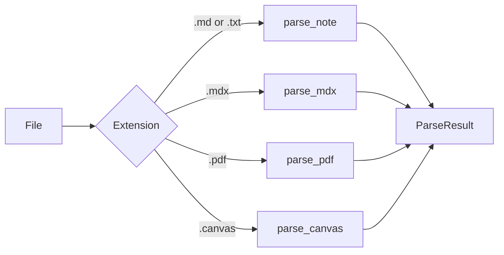

# File formats

The public configuration indexes five extensions. Adding an extension to YAML
without a parser does not create support.

| Format | Parser | Indexed text | Primary limit |
|---|---|---|---|
| `.md` | `markdown.py` | frontmatter, headings, and body | Full content CRUD |
| `.mdx` | `mdx.py` | Markdown after imports, exports, and JSX are removed | No full-content CRUD read |
| `.txt` | `markdown.py` | plain text split as Markdown | No full-content CRUD read |
| `.pdf` | `pdf.py` | page text with optional OCR | Binary file is search and move only |
| `.canvas` | `canvas.py` | Canvas card and label text | JSON file is search and move only |

## Dispatcher



Status is `success`, `empty`, `error`, or `unsupported`. A parser failure is
distinct from a valid empty document.

## Markdown

`.md` is the complete project format:

- YAML frontmatter is separated from the body;
- tags, title, aliases, and structured fields can enter the index;
- headings define chunk sections;
- wikilinks, Markdown links, embeds, and external links populate link data;
- create, read, append, and frontmatter tools operate on it.

`read_note`, `get_note_metadata`, `create_note`, `write_note`, `append_note`,
and `update_frontmatter` accept only `.md`.

## MDX

The parser removes module syntax and JSX before sending readable Markdown to
the standard parser. It never executes JavaScript or components. The cleanup is
heuristic; unusual MDX may retain noise or lose text, so add focused fixtures
before broadening patterns.

## Text

`.txt` uses the Markdown parser without requiring frontmatter. Line and
paragraph boundaries participate in chunking.

## PDF

PyMuPDF first extracts a page's text layer. When the page yields no text and
`pdf.ocr_enabled` is true, the parser can use Tesseract with configured
languages and DPI.

```yaml
pdf:
  ocr_enabled: true
  ocr_languages: "eng"
  ocr_dpi: 150
```

OCR requires Tesseract and matching language data on the machine. Missing OCR
does not prevent ordinary extraction from PDFs that already contain text.

## Obsidian Canvas

`.canvas` is JSON. The parser extracts text nodes, file-node labels, group
labels, and labeled edges. Coordinates and unlabeled edges do not become
chunks. No tool performs structured Canvas editing.

## Operations by format

| Operation | `.md` | `.mdx` | `.txt` | `.pdf` | `.canvas` |
|---|---:|---:|---:|---:|---:|
| Index and search | yes | yes | yes | yes | yes |
| List | yes | yes | yes | yes | yes |
| Full-content resource or CRUD read | yes | no | no | no | no |
| Create or edit content through CRUD | yes | no | no | no | no |
| Move or send to `.trash/` | yes | yes | yes | yes | yes |

`move_note` preserves the extension. `delete_note` moves the file to `.trash/`
and never deletes permanently.

## Adding a format

A parser contribution updates together:

1. dispatcher and `ParseResult` behavior;
2. extension defaults and validation;
3. scanner and watcher;
4. CRUD read/write policy;
5. synthetic empty, valid, and invalid fixtures;
6. configuration, MCP catalog, and this page.

The project does not claim a roadmap for unimplemented formats. Propose an
extraction contract and dependency impact through
[CONTRIBUTING.md](../../CONTRIBUTING.md).
