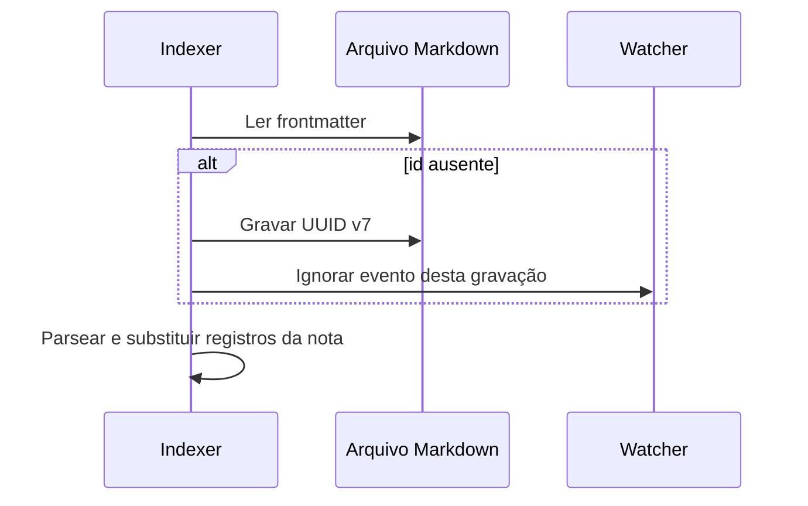

# UUID v7 nas notas

O projeto usa UUID v7, definido pela RFC 9562, para preencher o campo `id` do
frontmatter de notas Markdown. O valor combina um timestamp em milissegundos
com bits aleatórios e pode ser ordenado lexicalmente por tempo de geração.

```yaml
---
id: 019c503c-08e7-707f-9441-f4e6c5d0dd61
---
```

## Onde o ID é gerado

### `create_note`

Toda nota criada por `create_note` recebe um ID quando o frontmatter final não
contém `id`. Se o cliente fornecer o campo, o valor é preservado. Um schema
habilitado pode validar o tipo ou gerar o UUID durante a validação.

```python
create_note(
    path="notes/decision.md",
    content="# Decision",
    frontmatter={"status": "draft"},
)
```

### Reindexação incremental

`reindex_note` tenta adicionar um ID antes de parsear cada arquivo `.md`. A
gravação usa o mesmo fluxo atômico do CRUD e marca a alteração para que o
watcher não processe o evento produzido por ela.



Falha ao adicionar o ID não transforma automaticamente a nota em inválida. O
indexador registra o tipo da falha e continua quando o arquivo ainda pode ser
lido. O resultado inclui `id_added: true` somente quando houve gravação.

## Migração em lote

`generate_missing_ids` atua apenas em `.md` e oferece dry run:

```python
generate_missing_ids(folder="notes", dry_run=True)
```

O preview retorna `total_scanned`, `missing_ids`, `would_add`, até 100 paths e
`truncated`. Ele não altera o vault.

Depois de revisar a seleção:

```python
generate_missing_ids(folder="notes")
```

A execução retorna contagens, até 50 itens adicionados e até 10 detalhes de
erro. Cada nota modificada é reindexada em segundo plano.

## Schema opcional

O exemplo canônico define:

```yaml
frontmatter:
  enabled: false
  schema:
    id:
      type: "uuid"
      on_missing: "auto"
```

Com `frontmatter.enabled: true`, o validador verifica que um valor fornecido é
UUID e pode gerar um ausente. Com a validação desativada, o fluxo de criação e a
reindexação incremental ainda usam UUID v7 como fallback.

## O que o ID cobre hoje

- Identificação persistida no próprio frontmatter.
- Campo armazenado nos chunks do índice.
- Preservação durante move ou rename, pois o conteúdo do arquivo é mantido.
- Ordenação pelo instante de geração quando todos os valores são UUID v7.

## Limites atuais

- As tools públicas não oferecem busca direta por ID.
- `SearchResult` não inclui `id` no conjunto padrão de colunas.
- Wikilinks `[[id:...]]` não recebem resolução especial.
- O projeto não mantém registro global de unicidade entre vaults.
- Um `id` livre fornecido pelo cliente só é rejeitado como inválido quando o
  schema correspondente está habilitado.

Portanto, o ID funciona como metadado estável para consumidores que leem o
frontmatter. Ele ainda não substitui path nas APIs de leitura, escrita ou
navegação.

## Concorrência e recuperação

A gravação usa arquivo temporário e troca atômica. Se duas operações tentarem
preencher a mesma nota ao mesmo tempo, a última troca concluída determina o
conteúdo final. Não use geração concorrente em lote sobre o mesmo conjunto.

Antes de uma migração grande:

1. confirme um backup restaurável do vault;
2. execute `generate_missing_ids(dry_run=True)`;
3. restrinja por pasta quando possível;
4. execute a migração;
5. confira `errors` e uma amostra de frontmatters;
6. verifique `vault_stats` e faça uma busca focal.

`delete_note` continua recuperável em `.trash/`, mas a migração de IDs modifica
arquivos no lugar.

## Extração do timestamp

Em Python 3.14, `UUID.time` expõe o timestamp do UUID v7 em milissegundos:

```python
from datetime import datetime, timezone
from uuid import UUID

value = UUID("019c503c-08e7-707f-9441-f4e6c5d0dd61")
created_at = datetime.fromtimestamp(value.time / 1000, tz=timezone.utc)
```

Esse instante representa a geração do ID. Ele pode diferir da criação original
da nota, especialmente após uma migração.

## Referências

- [RFC 9562, UUID version 7](https://www.rfc-editor.org/rfc/rfc9562)
- [Módulo uuid do Python](https://docs.python.org/3/library/uuid.html)
- [Schema de frontmatter](frontmatter-schema.md)
