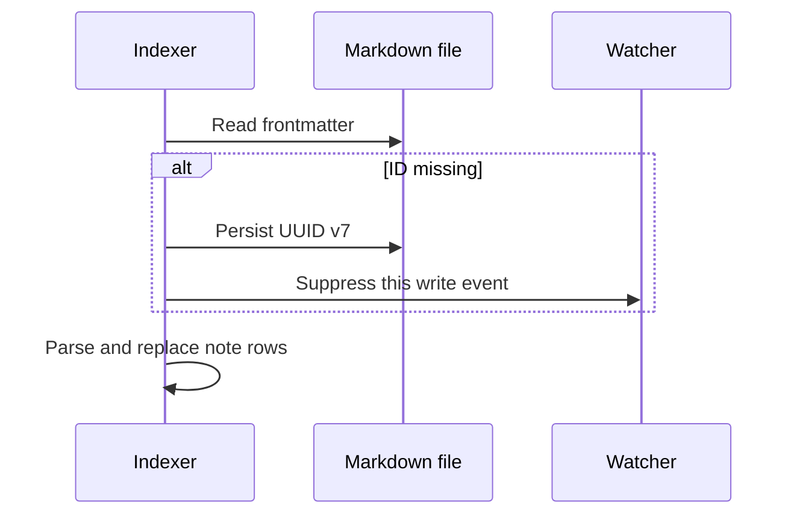

# UUID v7 note identifiers

The project uses UUID v7 from RFC 9562 for the Markdown frontmatter `id` field.
The value combines a millisecond timestamp with random bits and sorts
lexicographically by generation time.

```yaml
---
id: 019c503c-08e7-707f-9441-f4e6c5d0dd61
---
```

## Creation

`create_note` adds an identifier when final frontmatter has no `id`. A value
supplied by the client is preserved. An enabled schema can validate or generate
the field during validation.

```python
create_note(
    path="notes/decision.md",
    content="# Decision",
    frontmatter={"status": "draft"},
)
```

## Incremental reindexing

`reindex_note` attempts to add an ID before parsing each `.md` file. Persistence
uses the same atomic, path-locked write flow as CRUD and suppresses the watcher
event generated by that write.



Failure to add an ID does not automatically make a readable note invalid. The
indexer records the failure type and continues when parsing remains possible.
`id_added: true` appears only after a successful write.

## Batch migration

Preview Markdown notes without IDs:

```python
generate_missing_ids(folder="notes", dry_run=True)
```

The preview returns `total_scanned`, `missing_ids`, `would_add`, up to 100
paths, and `truncated`. It does not modify the vault.

After review:

```python
generate_missing_ids(folder="notes")
```

The run returns counts, up to 50 successful details, and up to 10 error details.
Each changed note schedules a background reindex.

## Optional schema

```yaml
frontmatter:
  enabled: false
  schema:
    id:
      type: "uuid"
      on_missing: "auto"
```

With validation enabled, supplied values must be valid UUIDs and absent values
can be generated. With validation disabled, creation and incremental reindexing
still use UUID v7 as a fallback.

## Current coverage

- The identifier persists in frontmatter.
- It is stored with index chunks.
- Moves and renames preserve it because file content is preserved.
- UUID v7 values order by generation time.

Current limits:

- no public search by ID;
- `SearchResult` does not include `id` by default;
- `[[id:...]]` has no special link resolution;
- no global uniqueness registry across vaults;
- a client-supplied value is rejected only when the matching schema is enabled.

The ID is stable metadata for frontmatter consumers. Paths remain the public
read, write, and navigation selectors.

## Concurrency and recovery

UUID writes use the shared lock and revision checks. A concurrent external
change returns a conflict instead of silently replacing the observed revision.
Avoid running overlapping batch migrations on the same notes.

Before a large migration:

1. verify a restorable vault backup;
2. run `generate_missing_ids(dry_run=True)`;
3. narrow by folder when possible;
4. run the migration;
5. inspect `errors` and sample frontmatter;
6. check `vault_stats` and run a focused search.

The migration changes files in place. `.trash/` behavior for `delete_note` does
not provide rollback for an ID migration.

## Timestamp extraction

Python 3.14 exposes the UUID v7 timestamp in milliseconds:

```python
from datetime import datetime, timezone
from uuid import UUID

value = UUID("019c503c-08e7-707f-9441-f4e6c5d0dd61")
created_at = datetime.fromtimestamp(value.time / 1000, tz=timezone.utc)
```

This is ID generation time, which can differ from original note creation time
after a migration.

## References

- [RFC 9562, UUID version 7](https://www.rfc-editor.org/rfc/rfc9562)
- [Python `uuid` module](https://docs.python.org/3/library/uuid.html)
- [Frontmatter schema](frontmatter-schema.md)
