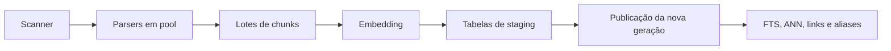

# Indexação

## Pipeline completo

O scanner filtra extensão, pasta ignorada e symlink que escapa do vault. Parsing
ocorre em `ThreadPoolExecutor`; embedding e persistência usam lotes com tamanho
ajustado pela configuração.

## Publicação segura

A reindexação completa escreve em tabelas de staging. A geração canônica só é
substituída depois que o staging está pronto. Se a publicação falhar, o
indexador restaura a versão anterior do LanceDB e reabre os handles canônicos.

O retorno informa `previous_index_preserved` em falhas conhecidas. Testes devem
provar que uma busca ainda acessa a geração anterior depois de interrupção.

## Incremental

`reindex_note` serializa escrita, parseia uma nota, gera embeddings e substitui
seus registros. Nota removida elimina registros derivados. Algumas operações
podem adicionar UUID ao Markdown; a gravação é marcada para o watcher ignorar o
evento gerado por ela.

## Limites

- `max_chunks_per_note` limita expansão de documentos grandes;
- `workers` limita parsing concorrente;
- `batch_size` controla memória de embedding e escrita;
- shutdown interrompe o pipeline em pontos observáveis.

## Dry run

O dry run conta os arquivos observados no scan e agrupa extensões. Ele também
informa o batch escolhido para o ambiente atual. Não faz parsing, não gera
chunks, não carrega modelos e não altera o índice. O retorno não estima duração
nem quantidade futura de chunks.

## O que medir

- notas e chunks por formato;
- tempo de scan, parsing, embedding, commit e índices auxiliares;
- pico de memória e tamanho do lote;
- quantidade de erros de parser;
- geração preservada em falha;
- hardware, modelo, device e estado de cache.

Use um vault sintético e o manifesto de [benchmarking.md](benchmarking.md).
