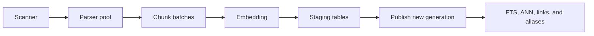

# Indexing performance

## Full pipeline

The scanner filters extensions, ignored folders, and symlinks that escape the
vault. Parsing uses a `ThreadPoolExecutor`; embedding and persistence use
configuration-controlled batches.

## Safe publication

A full rebuild writes staging tables. The canonical generation changes only
after staging is ready. On publication failure, the indexer restores the prior
LanceDB state and reopens canonical handles.

Known failures expose `previous_index_preserved`. Tests should prove that
search still reads the old generation after interruption.

## Incremental path

`reindex_note` serializes index writes, parses one file, generates embeddings,
and replaces its records. A deleted note removes derived rows. Some flows add a
UUID to Markdown and suppress the watcher event generated by that write.

## Bounds

- `max_chunks_per_note` bounds expansion of large documents;
- `workers` bounds concurrent parsing;
- `batch_size` controls embedding and write memory;
- shutdown interrupts the pipeline at observable boundaries.

## Dry run

Dry-run mode counts files in the current scan, groups extensions, and reports
the batch selected for the environment. It does not parse, chunk, load models,
or change the index. It does not estimate duration or future chunk count.

## Measure

- notes and chunks by format;
- scan, parse, embed, commit, and auxiliary-index duration;
- peak memory and batch size;
- parser error count;
- preservation of the old generation after failure;
- hardware, model, device, and cache state.

Use a synthetic vault and the [benchmark manifest](benchmarking.md).
