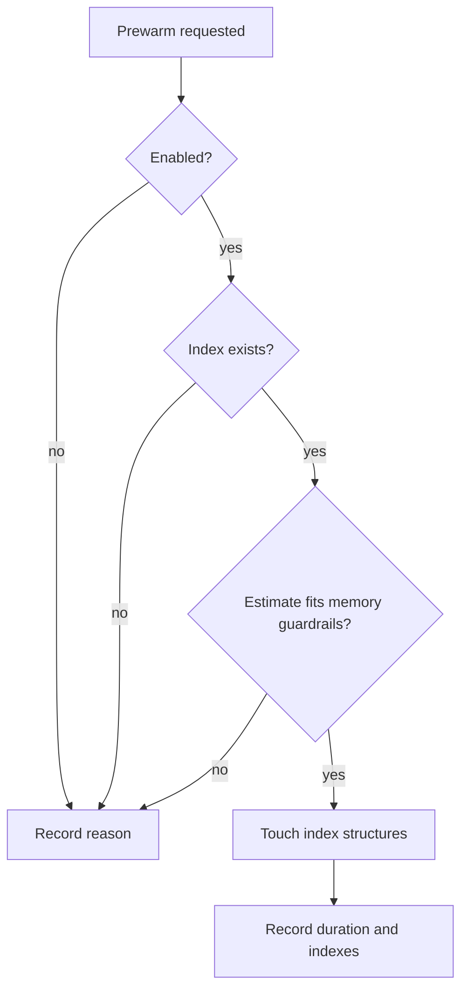

# Index prewarming

Prewarming touches LanceDB structures before first search so the operating
system can retain them in cache. It runs in the background and skips when memory
guardrails reject the estimate.

## Decision flow



## Configuration

| Field | Default | Function |
|---|---:|---|
| `prewarm.enabled` | `true` | Attempt prewarm during startup |
| `prewarm.max_ram_percent` | `0.25` | Maximum fraction of available memory |
| `prewarm.min_available_ram` | `2147483648` | Required free-memory floor in bytes |
| `prewarm.bytes_per_chunk` | `5120` | Protective size estimate |

`bytes_per_chunk` is a heuristic guardrail, not a measurement of real index
size.

## Observable state

`get_prewarm_status()` reports:

- enabled state;
- touched indexes;
- skip reason;
- timestamp;
- observed duration.

`system_stats` exposes the same state for diagnosis.

## Disable when

- memory is contested;
- a short-lived process cannot reuse the warm state;
- investigating startup regression;
- the backend already controls caching differently.

```yaml
prewarm:
  enabled: false
```

Compare cold and warm state separately, record available memory, and verify
identical search results. See [benchmarking.md](benchmarking.md).
