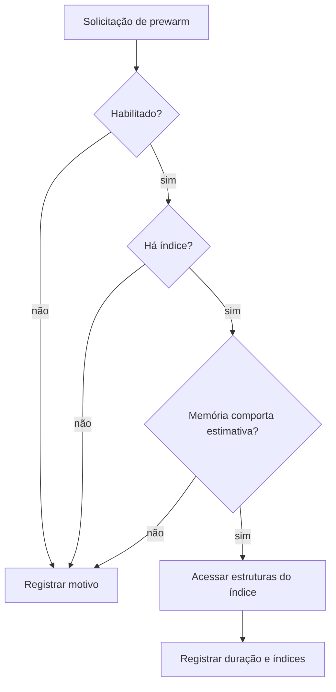

# Prewarm do índice

Prewarm acessa estruturas LanceDB antes da primeira busca para permitir que o
sistema operacional as mantenha em cache. Ele ocorre em background e pode ser
ignorado quando os guardrails de memória não permitem.

## Decisão



## Configuração

| Campo | Default | Função |
|---|---:|---|
| `prewarm.enabled` | `true` | Tenta prewarm no startup |
| `prewarm.max_ram_percent` | `0.25` | Fração máxima da memória disponível |
| `prewarm.min_available_ram` | `2147483648` | Memória livre mínima em bytes |
| `prewarm.bytes_per_chunk` | `5120` | Estimativa usada pelo guardrail |

`bytes_per_chunk` é heurística de proteção, não medição do índice real.

## Estado observável

`get_prewarm_status()` informa:

- `enabled`;
- índices acessados;
- motivo quando ignorado;
- timestamp;
- duração observada.

`system_stats` expõe esse estado para diagnóstico.

## Quando desativar

- ambiente com memória disputada;
- processo curto em que aquecimento não será reutilizado;
- investigação de regressão de startup;
- backend que já controla cache de outra forma.

```yaml
prewarm:
  enabled: false
```

## Validação

Compare cold e warm separadamente, registre memória disponível e confirme que o
resultado da busca permanece igual. Veja [benchmarking.md](benchmarking.md).
