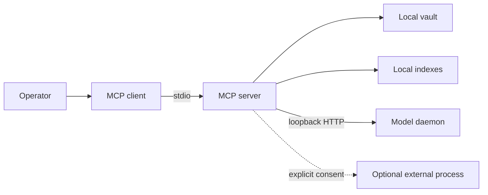

# Threat model

## Scope

This model covers the MCP server, local HTTP daemon, derived indexes, and read
and write operations for one vault. It assumes one operator on a controlled
machine. Public exposure or multi-user operation changes the assumptions and
requires authentication, authorization, and isolation that do not exist today.

## Assets

- Note content and metadata.
- Folder structure, tags, links, and implicit history.
- Local configuration, including external enrichment commands.
- Derived LanceDB indexes and SQLite catalogs.
- Machine resources, especially CPU, memory, storage, and cached models.

The index is rebuildable. The vault is primary and receives the highest
protection.

## Trust boundaries

| Boundary | Assumption | Required control |
|---|---|---|
| Client to MCP | Client may send hostile input | Type, size, and path validation |
| MCP to vault | Process can read and write | Vault containment and atomic replacement |
| MCP to daemon | Local service may die, redirect, or be replaced | Direct loopback connection, semantic health, identity, and timeout |
| MCP to external process | Content may leave the machine | Disabled by default and explicit consent |
| Vault to response | A note may contain hostile instructions | Client treats output as data |

## Priority threats

### Path escape

A relative path, symlink, or normalization difference can point outside the
vault. File operations resolve the target, verify containment under the real
vault root, and reject symlinks that escape it. Checks are repeated near the
operation where races matter.

### Loss or corruption during writes

Interrupted writes can truncate a note or derived index. Note persistence uses
a temporary file on the same filesystem, flushes where applicable, and replaces
atomically. Full indexing builds a new generation before changing the active
reference.

CRUD mutations serialize paths inside the process. Systems with `fcntl` also
coordinate cooperating processes. Inode, `mtime_ns`, and size checks detect
observable changes before persistence. External writers that ignore the lock
remain outside that guarantee, so conflicts return without replacing the
detected revision.

### Error and log disclosure

Library exceptions can contain absolute paths, queries, or content excerpts.
Public responses use stable codes and sanitized text. Operational logs omit
content, paths, and unnecessary identifiers.

### Exposed local service

The daemon has no authentication. Configuration, server, and client accept
loopback only. Remote access stays rejected until TLS, authentication, quotas,
and a dedicated threat model exist. The client disables environment proxies and
refuses redirects so requests stay on the configured loopback endpoint.

### Resource exhaustion

Queries, batches, documents, navigation depth, and HTTP bodies need explicit
limits. Timeouts do not replace size bounds. Boundary and over-boundary cases
belong in tests.

### Prompt injection in notes

Indexed content can ask a model to ignore rules or execute actions. The server
returns note data and does not decide an MCP client's instruction hierarchy.
Clients should delimit results, attribute their source, and require separate
authorization for every side effect.

### Dependency supply chain

ML and parsing dependencies handle complex formats. The lockfile participates
in builds, CI actions are pinned to commits, release artifacts are attested,
and automated updates pass through the same gates as manual changes.

## Data excluded from the repository

- `config.yaml`, `.env*`, and credentials.
- Vaults, notes, or fixtures copied from real data.
- Indexes, SQLite databases, generated embeddings, and logs.
- User paths, machine names, or personal identities in examples.

`scripts/check_publication.py` is an additional finite barrier. It checks the
tracked tree, distributions, public text patterns, and reachable commit
metadata. It does not inspect unrelated refs and does not replace human review.

## Outside current scope

- A public internet server.
- Isolation among several users.
- Access control by note or folder.
- At-rest vault encryption.
- Prevention of disclosure by an already-compromised MCP client.

## Review trigger

Revisit this model whenever a boundary changes, especially when adding a
network transport, external provider, executable format, or authentication.
