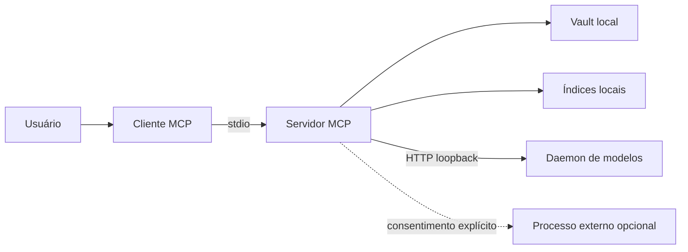

# Modelo de ameaças

## Escopo

Este modelo cobre o servidor MCP, o daemon HTTP local, os índices e as operações
de leitura e escrita em um único vault. Ele assume uma máquina controlada por
uma pessoa. Exposição pública ou uso multiusuário muda as premissas e exige
autenticação, autorização e isolamento ainda ausentes.

## Ativos

- Conteúdo e metadados das notas.
- Estrutura de pastas, tags, links e histórico implícito.
- Configuração local, incluindo comandos de enriquecimento externo.
- Índices LanceDB e catálogos SQLite derivados.
- Recursos da máquina, principalmente CPU, memória, disco e modelos em cache.

O índice é reconstruível. O vault é a fonte primária e merece o nível mais alto
de proteção.

## Fronteiras de confiança

| Fronteira | Premissa | Controle esperado |
|---|---|---|
| Cliente para MCP | Cliente pode enviar input hostil | Validação de tamanho, tipo e caminho |
| MCP para vault | Processo tem acesso de leitura e escrita | Contenção no vault e escrita atômica |
| MCP para daemon | Serviço local pode morrer ou ser substituído | Health check semântico e timeout |
| MCP para processo externo | Conteúdo pode sair da máquina | Desativado por padrão e consentimento explícito |
| Vault para resposta | Nota pode conter instrução maliciosa | Cliente trata retorno como dado |

## Ameaças prioritárias

### Escape de caminho

Um caminho relativo, symlink ou diferença de normalização pode apontar para
fora do vault. Toda operação de arquivo deve resolver o destino, verificar sua
contenção no vault real e rejeitar links que escapem da raiz.

### Perda ou corrupção durante escrita

Interrupção no meio de uma escrita pode truncar uma nota ou índice. Notas devem
usar arquivo temporário no mesmo sistema de arquivos, flush quando aplicável e
substituição atômica. Reindexação deve construir uma nova geração antes de
trocar a referência ativa.

As mutações CRUD serializam paths dentro do processo. Em sistemas com `fcntl`,
processos cooperativos também usam lock advisory. A revisão por inode,
`mtime_ns` e tamanho detecta alterações observáveis antes da persistência.
Escritores externos que ignoram o lock continuam fora dessa garantia; por isso,
conflitos são retornados ao cliente sem substituir a revisão detectada.

### Vazamento por erro ou log

Exceções de bibliotecas podem conter caminhos absolutos, consultas ou trechos de
conteúdo. Respostas públicas usam códigos estáveis e mensagens sanitizadas. Logs
operacionais evitam conteúdo, caminhos e identificadores desnecessários.

### Serviço local exposto

O daemon não implementa autenticação. Schema, servidor e cliente aceitam somente
loopback. Acesso remoto deve continuar rejeitado enquanto não houver TLS,
autenticação, quotas e um modelo de ameaças próprio para essa fronteira.

### Esgotamento de recursos

Queries, lotes, documentos, profundidade de navegação e corpos HTTP precisam de
limites. Timeouts não substituem limites de tamanho. Testes devem cobrir valores
no limite e acima dele.

### Prompt injection no conteúdo

Uma nota indexada pode pedir que o modelo ignore regras ou execute ações. O
servidor retorna conteúdo; ele não decide a hierarquia de instruções do cliente.
Clientes devem delimitar resultados, atribuir a origem e exigir autorização
separada para qualquer efeito colateral.

### Cadeia de dependências

Dependências de ML e parsing processam formatos complexos. O lockfile é parte
do build, actions de CI ficam fixadas por commit e atualizações automáticas
passam pelos mesmos gates.

## Dados que nunca entram no repositório

- `config.yaml`, `.env*` e credenciais.
- Vaults, notas e fixtures copiadas de dados reais.
- Índices, bancos SQLite, embeddings gerados e logs.
- Caminhos de usuário ou nomes de máquina em exemplos.

O script `scripts/check_publication.py` é uma barreira adicional. Ele verifica
os refs Git disponíveis localmente e rejeita e-mails pessoais nos metadados dos
commits, mas não enxerga refs que o clone não recebeu nem substitui revisão
humana.

## Fora do escopo atual

- Servidor público na internet.
- Isolamento entre vários usuários.
- Controle de acesso por nota ou pasta.
- Criptografia do vault em repouso.
- Garantia contra vazamento feito por um cliente MCP já comprometido.

## Revisão

Reavalie este documento quando uma fronteira mudar, especialmente ao adicionar
transporte de rede, provedor externo, formato executável ou autenticação.
